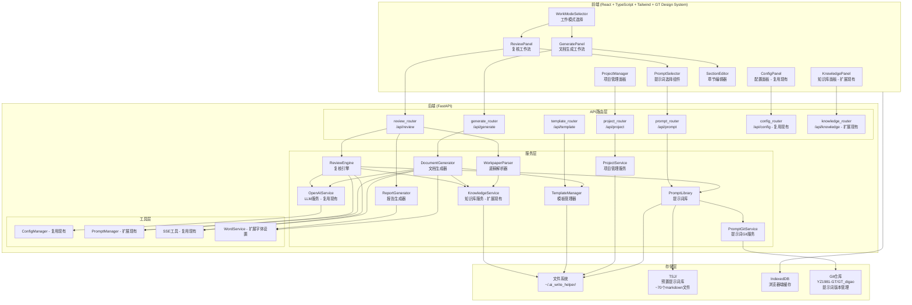
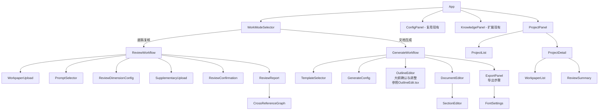

# 技术设计文档：审计底稿智能复核与文档生成程序

## 概述

本系统在现有AI标书写作助手（FastAPI + React）架构基础上扩展，新增审计底稿智能复核与文档生成两大核心功能模块。系统复用现有的LLM集成层（`OpenAIService`）、配置管理（`ConfigManager`）、知识库服务（`KnowledgeService`）和SSE流式输出基础设施，在此之上构建审计领域专用的复核引擎（`ReviewEngine`）、文档生成器（`DocumentGenerator`）、底稿解析器（`WorkpaperParser`）、模板管理器（`TemplateManager`）和提示词库（`PromptLibrary`）。

前端采用React + TypeScript + Tailwind CSS技术栈，严格遵循致同GT审计手册设计规范（`GT_Design_System`），使用gt-前缀组件库构建界面。系统提供双模式工作流入口：底稿复核模式（四步骤：底稿上传 → 提示词选择与维度配置 → 补充材料与确认 → 报告查看导出）和文档生成模式（四步骤：模板上传与配置 → 大纲识别与确认 → 逐章节生成与编辑 → 导出），通过SSE实时推送复核进度和生成内容。文档生成模式参照现有投标程序的章节拆分和技术方案生成方式：用户上传审计模板后，系统调用LLM自动识别模板中的章节结构（参照`generate_outline_with_old_prompt`模式），生成与现有`OutlineItem`格式一致的树形大纲，用户在前端确认/调整大纲后（参照`OutlineEdit.tsx`），系统逐章节生成内容（参照`_generate_chapter_content`的parent/sibling上下文注入机制），每个章节支持手动编辑和AI辅助修改（参照`ContentEdit.tsx`的`ManualEditState`模式），导出时支持用户自定义字体设置（参照现有`word_service.py`的字体机制）。复核提示词库从项目TSJ/目录加载约70个按会计科目分类的markdown预置提示词文件，提示词中的`{{#sys.files#}}`占位符在复核时替换为实际上传的底稿文件列表。

提示词库（`PromptLibrary`）作为知识库管理的一个分类，提供增强的提示词生命周期管理能力：用户可对预置提示词进行编辑修改（保留原始版本，支持恢复默认）、完全替换（标记为"用户替换"状态）、以及追加自定义补充提示词（标记为"用户追加"来源）。每个提示词携带来源标识（preset/user_modified/user_replaced/user_appended），系统在展示和管理时区分不同来源。提示词库通过 `PromptGitService` 关联远程Git仓库（YZ1981-GT/GT_digao），实现提示词的版本管理、变更追踪、团队间同步共享和冲突处理，支持按Git标签管理版本快照。

### 设计决策与理由

| 决策 | 理由 |
|------|------|
| 复用`OpenAIService`而非新建LLM服务 | 已有完善的多供应商支持、429重试、Token估算、上下文截断、DeepSeek R1兼容等能力 |
| 扩展`KnowledgeService`而非独立知识库 | 复用文件解析、缓存管理、全文搜索等基础能力，仅需新增审计专用分类 |
| 复用`ConfigManager`配置体系 | 多供应商管理、API密钥混淆、用量统计等能力直接可用 |
| 采用SSE而非WebSocket | 与现有`sse_response()`/`sse_with_heartbeat()`基础设施一致，前端`SSEParser`可直接复用 |
| IndexedDB缓存工作状态 | 与现有`draftStorage`模式一致，支持离线恢复 |
| FastAPI APIRouter模式 | 与现有`/api/config`、`/api/content`等路由组织方式一致 |
| 复核工作流增加提示词选择和确认步骤 | 用户需要根据不同底稿类型灵活选择复核策略，确认步骤避免误操作浪费LLM调用 |
| 复核过程中支持暂停补充材料 | 交叉引用的底稿可能未一次性上传完整，暂停补充避免复核结果不完整 |
| 预置提示词从TSJ目录加载markdown文件 | TSJ文件夹已包含约70个按会计科目分类的专业复核提示词，直接复用避免重复维护，markdown格式便于阅读和编辑 |
| 提示词按会计科目分类而非复核维度 | TSJ文件夹中的提示词天然按会计科目组织（货币资金、应收账款、存货等），与审计实务中按科目复核的工作习惯一致 |
| 提示词中{{#sys.files#}}占位符运行时替换 | TSJ提示词使用该占位符引用底稿文件列表，复核时动态替换为实际上传文件信息，保持提示词模板的通用性 |
| 章节编辑复用ContentEdit.tsx的ManualEditState模式 | 现有手动编辑+AI辅助修改+选中文本局部修改的交互模式已验证可用，直接复用降低开发成本 |
| 字体设置复用word_service.py的set_run_font机制 | 现有字体设置已处理中英文字体、EastAsia字体等复杂场景，扩展为用户可配置即可 |
| 提示词修改/替换保留原始版本 | 用户可能需要恢复默认预置提示词，保留原始版本避免不可逆操作；同时支持TSJ目录更新时对比差异 |
| 提示词来源四级标识（preset/user_modified/user_replaced/user_appended） | 清晰区分提示词生命周期状态，便于用户理解提示词来源和管理自定义版本 |
| Git集成使用独立的`PromptGitService`而非嵌入`PromptLibrary` | 职责分离：`PromptLibrary`负责提示词的本地管理，`PromptGitService`负责Git操作（拉取/提交/冲突处理/标签管理），降低耦合度 |
| Git认证支持SSH密钥和Token两种方式 | 兼容不同团队的Git仓库访问策略，SSH适合服务器部署，Token适合个人开发环境 |
| Git冲突提供三种解决方案（保留本地/使用远程/手动合并） | 覆盖常见冲突场景，手动合并为高级用户提供精细控制能力 |
| 提示词库作为知识库分类之一统一管理 | 与其他知识库分类（底稿模板库、监管规定库等）保持一致的文档管理和检索机制，降低用户认知负担 |
| 独立`ReportGenerator`服务而非嵌入`ReviewEngine` | 职责分离：`ReviewEngine`负责LLM复核分析，`ReportGenerator`负责报告结构化、导出Word/PDF，降低耦合度 |
| PDF导出使用`weasyprint`渲染HTML模板 | 保持与页面展示一致的排版格式，复用GT Design System的CSS样式，无需额外维护PDF模板 |
| 文档生成工作流导出步骤独立为`ExportPanel`组件 | 与需求文档三步骤工作流（模板配置 → 生成与编辑 → 导出）对齐，导出步骤包含字体设置和格式选择 |
| 模板章节识别复用`generate_outline_with_old_prompt`模式 | 现有投标程序已验证"上传文档→LLM提取大纲→用户确认→逐章节生成"的完整流程，审计文档生成直接复用此模式，降低开发成本 |
| 章节大纲格式复用`OutlineItem`（id/title/description/target_word_count/children） | 与现有投标程序的大纲数据结构完全一致，前端`OutlineEdit.tsx`的大纲编辑交互和`ContentEdit.tsx`的章节内容生成可直接复用 |
| 章节内容生成注入parent/sibling上下文 | 参照现有`_generate_chapter_content`的上下文注入机制，确保审计文档各章节间内容连贯、不重复 |

## 架构

### 系统架构图



### 目录结构（新增部分）

```
backend/app/
├── routers/
│   ├── review.py          # 复核相关API路由 (新增)
│   ├── generate.py        # 文档生成API路由 (新增)
│   ├── template.py        # 模板管理API路由 (新增)
│   ├── project.py         # 项目管理API路由 (新增)
│   ├── prompt.py          # 提示词管理API路由 (新增)
│   └── ... (现有路由保持不变)
├── services/
│   ├── review_engine.py   # 复核引擎服务 (新增)
│   ├── report_generator.py    # 复核报告生成与导出服务 (新增)
│   ├── document_generator.py  # 文档生成服务 (新增)
│   ├── workpaper_parser.py    # 底稿解析服务 (新增)
│   ├── template_service.py    # 模板管理服务 (新增)
│   ├── project_service.py     # 项目管理服务 (新增)
│   ├── prompt_library.py      # 提示词库服务 (新增，预置提示词从TSJ/目录加载)
│   ├── prompt_git_service.py  # 提示词Git版本管理服务 (新增，关联YZ1981-GT/GT_digao仓库)
│   ├── word_service.py        # Word导出服务 (扩展字体设置)
│   └── ... (现有服务保持不变)
├── utils/
│   └── prompt_manager.py  # 扩展审计专用提示词
└── models/
    └── audit_schemas.py   # 审计相关数据模型 (新增)

TSJ/                           # 预置复核提示词库 (已有，约70个markdown文件)
├── 货币资金提示词.md
├── 应收账款审计复核提示词.md
├── 存货审计复核提示词.md
├── 固定资产审计复核提示词.md
├── 长期股权投资审计复核提示词.md
├── 收入审计复核提示词.md
├── 成本审计复核提示词.md
├── 审计方案提示词.md
├── B60 总体审计策略及具体审计计划.md
└── ... (约70个按会计科目分类的提示词文件)

frontend/src/
├── components/
│   ├── WorkModeSelector.tsx   # 工作模式选择 (新增)
│   ├── ReviewWorkflow.tsx     # 复核工作流 (新增)
│   ├── GenerateWorkflow.tsx   # 文档生成工作流 (新增)
│   ├── WorkpaperUpload.tsx    # 底稿上传组件 (新增)
│   ├── ReviewDimensionConfig.tsx  # 复核维度配置 (新增)
│   ├── PromptSelector.tsx     # 提示词选择组件 (新增)
│   ├── SupplementaryUpload.tsx # 补充材料上传组件 (新增)
│   ├── ReviewConfirmation.tsx # 复核确认页面组件 (新增)
│   ├── ReviewReport.tsx       # 复核报告展示 (新增)
│   ├── TemplateSelector.tsx   # 模板选择组件 (新增)
│   ├── DocumentEditor.tsx     # 文档编辑组件 (新增)
│   ├── TemplateOutlineEditor.tsx  # 模板大纲确认与调整组件 (新增，参照OutlineEdit.tsx)
│   ├── SectionEditor.tsx      # 章节编辑器 - 手动编辑+AI修改 (新增，参照ContentEdit.tsx)
│   ├── ExportPanel.tsx        # 文档生成导出步骤面板 (新增)
│   ├── FontSettings.tsx       # 字体设置组件 (新增)
│   ├── ProjectPanel.tsx       # 项目管理面板 (新增)
│   ├── CrossReferenceGraph.tsx # 交叉引用关系图 (新增)
│   └── ... (现有组件保持不变)
├── services/
│   └── api.ts             # 扩展审计相关API接口
├── types/
│   └── audit.ts           # 审计相关类型定义 (新增)
└── utils/
    └── auditStorage.ts    # 审计工作状态IndexedDB缓存 (新增)
```


## 组件与接口

### 后端服务接口

#### 1. WorkpaperParser（底稿解析器）

```python
# backend/app/services/workpaper_parser.py
class WorkpaperParser:
    """审计底稿文件解析服务。
    
    复用现有 FileService 的文件提取能力（extract_text_from_pdf, extract_text_from_docx），
    新增 Excel 解析和底稿编号识别能力。
    """
    
    SUPPORTED_FORMATS = {'.xlsx', '.xls', '.docx', '.pdf'}
    MAX_FILE_SIZE = 50 * 1024 * 1024  # 50MB
    
    # 底稿编号正则：B-xx, C-xx, D-xx ~ M-xx
    WORKPAPER_ID_PATTERN = r'^([B-M])-?\d+'
    
    # 业务循环映射
    BUSINESS_CYCLE_MAP = {
        'D': '销售循环', 'E': '货币资金循环', 'F': '存货循环',
        'G': '投资循环', 'H': '固定资产循环', 'I': '无形资产循环',
        'J': '职工薪酬循环', 'K': '管理循环', 'L': '债务循环',
        'M': '权益循环', 'Q': '关联方循环',
    }
    
    async def parse_file(self, file_path: str, filename: str) -> WorkpaperParseResult:
        """解析单个底稿文件，返回结构化解析结果"""
        ...
    
    async def parse_excel(self, file_path: str) -> ExcelParseResult:
        """解析Excel文件，提取工作表、单元格数据、公式和合并单元格信息"""
        ...
    
    async def parse_word(self, file_path: str) -> WordParseResult:
        """解析Word文件，提取段落、表格、标题层级和批注"""
        ...
    
    async def parse_pdf(self, file_path: str) -> PdfParseResult:
        """解析PDF文件，提取文本和表格"""
        ...
    
    def identify_workpaper_type(self, filename: str, content: str) -> WorkpaperClassification:
        """识别底稿编号体系（B/C/D-M类）和业务循环分类"""
        ...
    
    async def batch_parse(self, files: List[Tuple[str, str]]) -> List[WorkpaperParseResult]:
        """批量解析多个底稿文件，按顺序返回各文件的独立解析结果"""
        ...
```

#### 2. ReviewEngine（复核引擎）

```python
# backend/app/services/review_engine.py
class ReviewEngine:
    """审计底稿多维度复核引擎。
    
    调用 OpenAIService.stream_chat_completion() 进行LLM推理，
    复用其429重试、Token估算、上下文截断等能力。
    通过 KnowledgeService 检索审计准则和质控标准作为复核依据。
    通过 PromptLibrary 获取用户选择的复核提示词。
    支持复核过程中暂停等待用户补充材料。
    """
    
    # 复核维度定义
    REVIEW_DIMENSIONS = {
        'format': '格式规范性',
        'data_reconciliation': '数据勾稽关系',
        'accounting_compliance': '会计准则合规性',
        'audit_procedure': '审计程序完整性',
        'evidence_sufficiency': '审计证据充分性',
    }
    
    def __init__(self):
        self.openai_service = OpenAIService()  # 复用现有LLM服务
        self.knowledge_service = knowledge_service  # 复用现有知识库单例
        self.prompt_library = PromptLibrary()  # 提示词库
    
    async def review_workpaper_stream(
        self,
        workpaper: WorkpaperParseResult,
        dimensions: List[str],
        custom_dimensions: Optional[List[str]] = None,
        project_context: Optional[ProjectContext] = None,
        prompt_id: Optional[str] = None,
        custom_prompt: Optional[str] = None,
        supplementary_materials: Optional[List[SupplementaryMaterial]] = None,
    ) -> AsyncGenerator[str, None]:
        """流式执行底稿复核，逐维度分析并通过SSE输出进度和结果。
        
        SSE事件格式与现有 content router 一致：
        - {'status': 'started', 'message': '...'}
        - {'status': 'dimension_start', 'dimension': '格式规范性'}
        - {'status': 'streaming', 'content': '...'}  # 增量chunk
        - {'status': 'dimension_complete', 'dimension': '...', 'findings': [...]}
        - {'status': 'need_supplementary', 'required_workpapers': [...]}  # 需要补充材料
        - {'status': 'completed', 'report': {...}}
        """
        ...
    
    async def _review_dimension(
        self,
        workpaper: WorkpaperParseResult,
        dimension: str,
        knowledge_context: str,
        review_prompt: Optional[str] = None,
        supplementary_context: Optional[str] = None,
    ) -> List[ReviewFinding]:
        """执行单个维度的复核分析，支持注入用户选择的提示词和补充材料上下文"""
        ...
    
    async def _build_review_prompt(
        self,
        workpaper: WorkpaperParseResult,
        dimension: str,
        knowledge_context: str,
        user_prompt: Optional[str] = None,
        supplementary_context: Optional[str] = None,
    ) -> List[dict]:
        """构建复核提示词，注入审计专业上下文。
        
        复用 prompt_manager 的反AI痕迹技巧，
        新增审计专业上下文注入（业务循环、准则条款、质控标准）。
        若用户选择了预置或自定义提示词，将其合并到系统提示词中。
        若有补充材料，将其作为额外上下文注入。
        对预置提示词中的 {{#sys.files#}} 占位符，替换为实际上传的底稿文件列表。
        """
        ...
    
    async def check_required_references(
        self,
        workpaper: WorkpaperParseResult,
        uploaded_workpaper_ids: List[str],
    ) -> List[RequiredReference]:
        """检查复核所需的相关底稿是否已上传，返回缺失的引用清单。
        
        在正式复核前调用，若发现缺失引用，前端展示补充上传入口。
        """
        ...
    
    async def analyze_cross_references(
        self,
        workpapers: List[WorkpaperParseResult],
    ) -> CrossReferenceAnalysis:
        """分析底稿间交叉引用关系，验证引用完整性和逻辑一致性"""
        ...
    
    def classify_risk_level(self, finding: dict) -> RiskLevel:
        """对复核发现进行风险等级分类（高/中/低）"""
        ...
```

#### 3. DocumentGenerator（文档生成器）

```python
# backend/app/services/document_generator.py
class DocumentGenerator:
    """基于模板的审计文档生成服务。
    
    核心流程参照现有投标程序的章节拆分和内容生成模式：
    1. 用户上传模板文件（审计计划、审计小结、尽调报告等）
    2. 调用 _extract_template_outline() 通过LLM自动识别模板中的章节结构，
       生成与现有 OutlineItem 格式一致的树形大纲（id/title/description/target_word_count/children）
    3. 用户在前端确认/调整章节大纲（参照现有 OutlineEdit.tsx 的交互模式）
    4. 逐章节调用 _generate_section_content() 流式生成内容，
       复用 OpenAIService.stream_chat_completion() 和 _generate_chapter_content 的
       parent_chapters/sibling_chapters 上下文注入机制
    5. 每个章节支持手动编辑和AI对话式修改（参照 ContentEdit.tsx 的 ManualEditState 模式）
    
    与现有投标程序的关键复用点：
    - 大纲结构格式：复用 OutlineItem（id/title/description/target_word_count/children）
    - 章节内容生成：复用 _generate_chapter_content 的 parent/sibling 上下文注入
    - 章节修改：复用 revise_chapter_content 的对话式修改 + 选中文本局部修改
    - SSE流式输出：复用 sse_response/sse_with_heartbeat 基础设施
    - Word导出：复用 WordExportService.build_document() 的大纲→Word转换
    """
    
    def __init__(self):
        self.openai_service = OpenAIService()
        self.knowledge_service = knowledge_service
        self.template_manager = TemplateManager()
    
    async def extract_template_outline(
        self,
        template_id: str,
    ) -> List[Dict[str, Any]]:
        """从用户上传的模板文件中自动识别章节结构，生成树形大纲。
        
        参照现有 generate_outline_with_old_prompt 的模式：
        将模板解析后的文本内容发送给LLM，要求其识别章节标题层级、
        表格结构和需要填充的内容区域，返回与 OutlineItem 格式一致的JSON大纲。
        
        返回格式与现有 OutlineItem 一致：
        [
            {
                "id": "1",
                "title": "一、审计项目概况",
                "description": "包含客户基本信息、审计范围等",
                "target_word_count": 2000,
                "fillable_fields": ["客户名称", "审计期间", "审计范围"],
                "children": [
                    {
                        "id": "1.1",
                        "title": "（一）客户基本信息",
                        "description": "...",
                        "target_word_count": 800,
                        "fillable_fields": ["客户名称", "注册地址"],
                        "children": []
                    }
                ]
            }
        ]
        """
        ...
    
    async def generate_document_stream(
        self,
        template_id: str,
        outline: List[Dict[str, Any]],
        knowledge_library_ids: List[str],
        project_info: ProjectInfo,
    ) -> AsyncGenerator[str, None]:
        """逐章节流式生成审计文档内容。
        
        参照现有 content router 的 generate_chapter_content_stream 模式：
        遍历大纲中的叶子章节，逐个调用 _generate_section_content()，
        每个章节生成时注入 parent_chapters 和 sibling_chapters 上下文，
        确保章节间内容连贯。
        
        SSE事件格式：
        - {'status': 'started', 'message': '...'}
        - {'status': 'loading_knowledge', 'message': '正在读取知识库...'}
        - {'status': 'section_start', 'section': '...', 'index': 0}
        - {'status': 'streaming', 'content': '...', 'section_index': 0}  # 增量chunk
        - {'status': 'section_complete', 'section': '...', 'content': '...'}
        - {'status': 'completed', 'document': {...}}
        """
        ...
    
    async def _generate_section_content(
        self,
        section: Dict[str, Any],
        parent_sections: Optional[List[Dict[str, Any]]],
        sibling_sections: Optional[List[Dict[str, Any]]],
        project_info: ProjectInfo,
        knowledge_context: str,
        target_word_count: int,
    ) -> AsyncGenerator[str, None]:
        """生成单个章节内容。
        
        参照现有 OpenAIService._generate_chapter_content() 的模式：
        - 注入 parent_sections（上级章节标题和已生成内容摘要）提供层级上下文
        - 注入 sibling_sections（同级章节标题和已生成内容摘要）避免内容重复
        - 注入 knowledge_context（从知识库检索的相关参考内容）
        - 注入 project_info（客户名称、审计期间等项目特定信息）
        - 使用章节自身的 target_word_count 控制生成长度
        - 通过 stream_chat_completion() 流式输出
        
        生成规则：
        - 优先使用知识库中的真实信息填充模板对应区域
        - 知识库未覆盖的填充区域标注【待补充】占位符
        - 严禁编造具体数字、案例、人员姓名等事实性信息
        - 对模板中的表格结构，按表格格式生成内容
        """
        ...
    
    async def revise_section_stream(
        self,
        section_index: int,
        current_content: str,
        user_instruction: str,
        document_context: DocumentContext,
        messages: List[Dict[str, str]],
        selected_text: Optional[str] = None,
    ) -> AsyncGenerator[str, None]:
        """AI对话式修改章节内容。
        
        完全复用现有 revise_chapter_content 的模式：
        - 支持多轮对话修改（通过 messages 传递对话历史）
        - 支持全文修改和选中文本局部修改
        - 若 selected_text 非空，仅对选中部分进行修改，其余内容保持不变
        - 参照 ContentEdit.tsx 的 ManualEditState 交互模式
        """
        ...
    
    async def export_to_word(
        self,
        document: GeneratedDocument,
        template_id: str,
        font_settings: Optional[FontSettings] = None,
    ) -> bytes:
        """导出为Word格式。
        
        复用现有 WordExportService.build_document() 的大纲→Word转换能力：
        将 GeneratedDocument 的章节结构转换为 OutlineItem 格式，
        调用 build_document() 生成Word文档。
        
        若 font_settings 非空，使用用户指定的字体设置；
        否则使用 DEFAULT_FONT_NAME 默认字体。
        字体应用逻辑复用 word_service.py 的 set_run_font() 和 set_paragraph_font()。
        """
        ...
    
    def parse_document_to_structured(self, document: GeneratedDocument) -> dict:
        """将文档解析为结构化数据格式"""
        ...
    
    def structured_to_document(self, data: dict) -> GeneratedDocument:
        """从结构化数据重建文档对象"""
        ...
```

#### 4. TemplateManager（模板管理器）

```python
# backend/app/services/template_service.py
class TemplateManager:
    """审计底稿模板管理服务。
    
    存储路径遵循现有 KnowledgeService 的文件系统模式：
    ~/.ai_write_helper/templates/{template_id}/
    """
    
    TEMPLATE_DIR = os.path.join(os.path.expanduser('~'), '.ai_write_helper', 'templates')
    
    TEMPLATE_TYPES = {
        'audit_plan': '审计计划模板',
        'audit_summary': '审计小结模板',
        'due_diligence': '尽调报告模板',
        'audit_report': '审计报告模板',
        'custom': '其他自定义模板',
    }
    
    def upload_template(self, file_path: str, filename: str, template_type: str) -> TemplateInfo:
        """上传并解析模板文件"""
        ...
    
    def parse_template_structure(self, file_path: str) -> TemplateStructure:
        """解析模板结构，提取章节标题、表格结构和填充区域"""
        ...
    
    def list_templates(self) -> List[TemplateInfo]:
        """列出所有已上传模板"""
        ...
    
    def delete_template(self, template_id: str) -> bool:
        """删除模板"""
        ...
    
    def update_template(self, template_id: str, file_path: str, filename: str) -> TemplateInfo:
        """更新模板（替换并重新解析）"""
        ...
    
    def get_template(self, template_id: str) -> Optional[TemplateInfo]:
        """获取模板详情"""
        ...
```

#### 5. PromptLibrary（提示词库）

```python
# backend/app/services/prompt_library.py
class PromptLibrary:
    """复核提示词管理服务。
    
    预置提示词从项目 TSJ/ 目录加载 markdown 文件，按会计科目分类。
    每个 markdown 文件是一个独立的预置提示词，包含完整的复核清单、
    审计认定要点、程序要点、风险评估等内容。
    提示词中的 {{#sys.files#}} 占位符在复核时替换为实际上传的底稿文件列表。
    
    支持用户对预置提示词进行修改（保留原始版本）、替换（完全替换内容）和追加补充。
    每个提示词携带来源标识（preset/user_modified/user_replaced/user_appended）。
    通过 PromptGitService 实现与远程Git仓库的同步。
    
    用户自定义提示词存储路径：
    ~/.ai_write_helper/prompts/{prompt_id}.json
    """
    
    # TSJ 目录路径（预置提示词来源）
    TSJ_DIR = os.path.join(os.path.dirname(__file__), '..', '..', '..', 'TSJ')
    
    # 用户自定义提示词存储路径
    CUSTOM_PROMPT_DIR = os.path.join(os.path.expanduser('~'), '.ai_write_helper', 'prompts')
    
    # 预置提示词按会计科目分类（从 TSJ 文件夹中的 markdown 文件名推断）
    PRESET_CATEGORIES = {
        'monetary_funds': '货币资金',
        'accounts_receivable': '应收账款',
        'inventory': '存货',
        'fixed_assets': '固定资产',
        'long_term_equity_investment': '长期股权投资',
        'revenue': '收入',
        'cost': '成本',
        'intangible_assets': '无形资产',
        'employee_compensation': '职工薪酬',
        'taxes_payable': '应交税费',
        'other_payables': '其他应付款',
        'accounts_payable': '应付账款',
        'construction_in_progress': '在建工程',
        'investment_property': '投资性房地产',
        'borrowings': '借款',
        'equity': '所有者权益',
        'audit_plan': '审计方案',
        'overall_strategy': '总体审计策略及具体审计计划',
        'other': '其他',
    }
    
    # 文件占位符，复核时替换为实际底稿文件列表
    FILE_PLACEHOLDER = '{{#sys.files#}}'
    
    def __init__(self):
        self._preset_prompts: Optional[List[ReviewPromptInfo]] = None
        self.git_service = PromptGitService()  # Git版本管理服务
    
    def _load_preset_prompts(self) -> List[ReviewPromptInfo]:
        """从 TSJ/ 目录扫描并加载所有 markdown 格式的预置提示词文件"""
        ...
    
    def _classify_by_subject(self, filename: str) -> str:
        """根据文件名推断会计科目分类"""
        ...
    
    def resolve_file_placeholder(self, prompt_content: str, uploaded_files: List[Dict[str, str]]) -> str:
        """将提示词内容中的 {{#sys.files#}} 占位符替换为实际上传的底稿文件列表信息。
        
        Args:
            prompt_content: 原始提示词内容
            uploaded_files: 已上传底稿文件列表 [{'filename': '...', 'parse_status': '...'}]
        
        Returns:
            替换占位符后的提示词内容
        """
        ...
    
    def list_prompts(self, subject: Optional[str] = None) -> List[ReviewPromptInfo]:
        """列出提示词，可按会计科目筛选。返回结果包含来源标识（preset/user_modified/user_replaced/user_appended）"""
        ...
    
    def get_prompt(self, prompt_id: str) -> Optional[ReviewPromptDetail]:
        """获取提示词完整内容（预置提示词从 TSJ 文件读取，自定义从 JSON 读取）。
        若预置提示词存在用户修改版本，返回修改版本并附带原始内容。"""
        ...
    
    def save_custom_prompt(self, name: str, content: str, subject: Optional[str] = None) -> ReviewPromptInfo:
        """保存用户自定义提示词（来源标记为 user_appended）"""
        ...
    
    def edit_preset_prompt(self, prompt_id: str, new_content: str) -> ReviewPromptInfo:
        """编辑预置提示词内容，保存为用户自定义版本（来源标记为 user_modified），
        同时保留原始预置版本（从TSJ_Directory加载的默认版本）"""
        ...
    
    def replace_preset_prompt(self, prompt_id: str, new_content: str) -> ReviewPromptInfo:
        """完全替换预置提示词内容（来源标记为 user_replaced），
        保留原始预置版本供恢复"""
        ...
    
    def restore_preset_default(self, prompt_id: str) -> ReviewPromptInfo:
        """恢复预置提示词为TSJ_Directory中的原始默认版本，
        删除用户的自定义修改或替换版本"""
        ...
    
    def delete_prompt(self, prompt_id: str) -> bool:
        """删除自定义提示词（预置提示词不可删除）"""
        ...
    
    def get_preset_prompts(self) -> List[ReviewPromptInfo]:
        """获取所有预置提示词（从 TSJ 目录加载）"""
        ...
    
    def refresh_presets(self) -> None:
        """重新扫描 TSJ 目录，同步更新预置提示词列表。
        若用户已对某提示词进行过修改或替换，保留用户的自定义版本并标记预置版本已更新。"""
        ...
    
    def increment_usage_count(self, prompt_id: str) -> None:
        """增加提示词使用次数"""
        ...
    
    def sync_from_git(self) -> GitSyncResult:
        """从Git仓库拉取最新提示词并更新本地TSJ目录。
        委托给 PromptGitService.pull_latest()"""
        ...
    
    def push_to_git(self, prompt_id: str, change_type: str, operator: str) -> GitSyncResult:
        """将本地提示词变更提交到Git仓库。
        委托给 PromptGitService.commit_and_push()"""
        ...
```

#### 6. ReportGenerator（报告生成器）

```python
# backend/app/services/report_generator.py
class ReportGenerator:
    """复核报告生成与导出服务。
    
    将 ReviewEngine 的复核结果整合为结构化复核报告，
    支持导出为 Word（.docx）和 PDF 格式。
    Word 导出复用现有 word_service.py 的文档生成能力，
    PDF 导出使用 weasyprint 或 reportlab 将 HTML 渲染为 PDF。
    """
    
    def __init__(self):
        self.word_service = WordService()  # 复用现有Word导出服务
    
    def generate_report(
        self,
        workpaper_ids: List[str],
        dimensions: List[str],
        findings: List[ReviewFinding],
        conclusion: str,
        project_id: Optional[str] = None,
    ) -> ReviewReport:
        """将复核结果整合为结构化复核报告。
        
        报告结构：复核概要（底稿信息、复核时间、复核维度）、
        问题清单（按风险等级排序）、每个问题的详细描述和修改建议、复核结论。
        自动计算风险等级统计汇总（高/中/低风险问题数量）。
        """
        ...
    
    def export_to_word(self, report: ReviewReport) -> bytes:
        """导出复核报告为Word格式（.docx）。
        
        导出内容包含完整的问题清单、修改建议和复核结论。
        复用 word_service.py 的文档生成和字体设置能力。
        """
        ...
    
    def export_to_pdf(self, report: ReviewReport) -> bytes:
        """导出复核报告为PDF格式。
        
        保持与页面展示一致的排版格式，使用 weasyprint 将
        报告 HTML 模板渲染为 PDF。页面设置为 A4 尺寸
        （页边距上下20mm、左右15mm），正文使用黑白配色。
        """
        ...
    
    def parse_report_to_structured(self, report: ReviewReport) -> dict:
        """将复核报告解析为结构化数据格式"""
        ...
    
    def structured_to_report(self, data: dict) -> ReviewReport:
        """从结构化数据重建复核报告对象（往返一致性）"""
        ...
```

#### 7. PromptGitService（提示词Git版本管理服务）

```python
# backend/app/services/prompt_git_service.py
class PromptGitService:
    """提示词Git版本管理服务。
    
    负责与远程Git仓库（YZ1981-GT/GT_digao）的交互，
    包括拉取同步、提交推送、冲突处理和标签管理。
    使用 gitpython 库操作本地Git仓库。
    
    Git仓库本地克隆路径：~/.ai_write_helper/prompt_git/
    """
    
    GIT_REPO_DIR = os.path.join(os.path.expanduser('~'), '.ai_write_helper', 'prompt_git')
    
    def __init__(self):
        self._repo = None  # git.Repo instance
    
    def configure(self, config: GitConfig) -> bool:
        """配置Git仓库关联：URL、认证凭据（SSH密钥或Token）和目标分支。
        若本地仓库不存在则执行 git clone，否则更新 remote URL。"""
        ...
    
    def get_config(self) -> Optional[GitConfig]:
        """获取当前Git仓库配置"""
        ...
    
    def pull_latest(self) -> GitSyncResult:
        """从远程Git仓库拉取最新提示词文件，更新本地TSJ目录。
        返回同步结果（新增/更新/删除的文件列表）。"""
        ...
    
    def commit_and_push(
        self,
        changed_files: List[str],
        change_type: str,
        prompt_name: str,
        operator: str,
    ) -> GitSyncResult:
        """将本地变更提交到远程Git仓库。
        提交信息格式：[{change_type}] {prompt_name} - by {operator}
        change_type: modify/replace/append"""
        ...
    
    def get_commit_history(self, file_path: Optional[str] = None, limit: int = 50) -> List[GitCommitHistory]:
        """获取提示词的Git版本历史。
        若指定 file_path，返回该文件的提交历史；否则返回全部提交历史。"""
        ...
    
    def detect_conflicts(self) -> List[GitConflictInfo]:
        """检测本地与远程的冲突文件列表"""
        ...
    
    def resolve_conflict(self, file_path: str, resolution: str) -> bool:
        """解决冲突。
        resolution: 'keep_local' | 'use_remote' | 'manual_merge'
        manual_merge 时前端需先提交合并后的内容。"""
        ...
    
    def create_tag(self, tag_name: str, message: str) -> bool:
        """创建Git标签（版本快照）"""
        ...
    
    def list_tags(self) -> List[Dict[str, str]]:
        """列出所有Git标签"""
        ...
```

#### 8. ProjectService（项目管理服务）

```python
# backend/app/services/project_service.py
class ProjectService:
    """审计项目管理服务。
    
    存储路径：~/.ai_write_helper/projects/{project_id}/
    采用JSON文件存储项目元数据，与 ConfigManager 的文件存储模式一致。
    """
    
    PROJECT_DIR = os.path.join(os.path.expanduser('~'), '.ai_write_helper', 'projects')
    
    ROLES = {
        'partner': '合伙人',       # 全部权限
        'manager': '项目经理',     # 项目内全部权限
        'auditor': '审计员',       # 上传底稿+查看报告
        'qc': '质控人员',          # 查看所有项目报告
    }
    
    ROLE_PERMISSIONS = {
        'partner': {'create_project', 'delete_project', 'manage_members', 'upload_workpaper', 
                     'delete_workpaper', 'start_review', 'view_report', 'edit_report', 'export_report'},
        'manager': {'upload_workpaper', 'delete_workpaper', 'start_review', 'view_report', 
                     'edit_report', 'export_report', 'manage_members'},
        'auditor': {'upload_workpaper', 'view_report'},
        'qc': {'view_report'},
    }
    
    def create_project(self, project: ProjectCreateRequest) -> ProjectInfo:
        """创建审计项目"""
        ...
    
    def get_project(self, project_id: str) -> Optional[ProjectInfo]:
        """获取项目详情"""
        ...
    
    def list_projects(self, user_id: str, user_role: str) -> List[ProjectInfo]:
        """列出用户有权限访问的项目"""
        ...
    
    def add_workpaper_to_project(self, project_id: str, workpaper_id: str) -> bool:
        """将底稿关联到项目"""
        ...
    
    def check_permission(self, user_role: str, action: str) -> bool:
        """检查用户角色是否有执行指定操作的权限"""
        ...
    
    def get_project_review_summary(self, project_id: str) -> ProjectReviewSummary:
        """获取项目复核进度概览"""
        ...
    
    def filter_workpapers(self, project_id: str, business_cycle: str = None, 
                          workpaper_type: str = None) -> List[WorkpaperInfo]:
        """按业务循环和底稿类型筛选底稿"""
        ...
    
    def link_template_to_project(self, project_id: str, template_id: str) -> bool:
        """将模板与项目关联"""
        ...
```

### API端点设计

#### 复核相关 `/api/review`

| 方法 | 路径 | 说明 | 请求/响应 |
|------|------|------|-----------|
| POST | `/api/review/upload` | 上传底稿文件 | `UploadFile` → `WorkpaperUploadResponse` |
| POST | `/api/review/upload-batch` | 批量上传底稿 | `List[UploadFile]` → `List[WorkpaperUploadResponse]` |
| POST | `/api/review/check-references` | 检查所需相关底稿 | `ReferenceCheckRequest` → `List[RequiredReference]` |
| POST | `/api/review/upload-supplementary` | 上传补充材料 | `UploadFile + text_content` → `SupplementaryMaterial` |
| POST | `/api/review/start` | 发起复核（SSE流式） | `ReviewRequest` → SSE stream |
| GET | `/api/review/report/{review_id}` | 获取复核报告 | → `ReviewReport` |
| POST | `/api/review/report/{review_id}/export` | 导出复核报告 | `ExportRequest` → Word/PDF文件 |
| PATCH | `/api/review/finding/{finding_id}/status` | 更新问题处理状态 | `FindingStatusUpdate` → `success` |
| GET | `/api/review/cross-references/{project_id}` | 获取交叉引用分析 | → `CrossReferenceAnalysis` |

#### 文档生成相关 `/api/generate`

| 方法 | 路径 | 说明 | 请求/响应 |
|------|------|------|-----------|
| POST | `/api/generate/extract-outline` | 从模板提取章节大纲 | `{template_id}` → `List[OutlineItem]` |
| PUT | `/api/generate/confirm-outline` | 用户确认/调整大纲后保存 | `{template_id, outline}` → `success` |
| POST | `/api/generate/start` | 基于确认的大纲逐章节生成（SSE流式） | `GenerateRequest` → SSE stream |
| POST | `/api/generate/generate-section` | 单章节内容生成（SSE流式） | `SectionGenerateRequest` → SSE stream |
| POST | `/api/generate/revise-section` | AI修改章节（SSE流式） | `SectionRevisionRequest` → SSE stream |
| POST | `/api/generate/export` | 导出生成文档（支持字体设置） | `DocumentExportRequest` → Word文件 |

#### 提示词管理相关 `/api/prompt`

| 方法 | 路径 | 说明 | 请求/响应 |
|------|------|------|-----------|
| GET | `/api/prompt/list` | 获取提示词列表（支持会计科目筛选） | `?subject=monetary_funds` → `List[ReviewPromptInfo]` |
| GET | `/api/prompt/{prompt_id}` | 获取提示词详情（含原始内容和自定义版本） | → `ReviewPromptDetail` |
| POST | `/api/prompt/save` | 保存用户追加的自定义提示词 | `SavePromptRequest` → `ReviewPromptInfo` |
| PUT | `/api/prompt/{prompt_id}/edit` | 编辑预置提示词（保存为用户修改版本） | `EditPromptRequest` → `ReviewPromptInfo` |
| PUT | `/api/prompt/{prompt_id}/replace` | 替换预置提示词（完全替换内容） | `ReplacePromptRequest` → `ReviewPromptInfo` |
| POST | `/api/prompt/{prompt_id}/restore` | 恢复预置提示词为默认版本 | → `ReviewPromptInfo` |
| DELETE | `/api/prompt/{prompt_id}` | 删除自定义提示词 | → `success` |
| POST | `/api/prompt/git/config` | 配置Git仓库关联 | `GitConfig` → `success` |
| GET | `/api/prompt/git/config` | 获取Git仓库配置 | → `GitConfig` |
| POST | `/api/prompt/git/sync` | 从Git仓库拉取同步最新提示词 | → `GitSyncResult` |
| POST | `/api/prompt/git/push` | 将本地变更提交到Git仓库 | `GitPushRequest` → `GitSyncResult` |
| GET | `/api/prompt/git/history` | 获取提示词Git版本历史 | `?file_path=xxx&limit=50` → `List[GitCommitHistory]` |
| GET | `/api/prompt/git/conflicts` | 检测Git冲突 | → `List[GitConflictInfo]` |
| POST | `/api/prompt/git/resolve` | 解决Git冲突 | `GitResolveRequest` → `success` |
| POST | `/api/prompt/git/tag` | 创建Git版本标签 | `GitTagRequest` → `success` |
| GET | `/api/prompt/git/tags` | 列出所有Git标签 | → `List[GitTagInfo]` |

#### 模板管理相关 `/api/template`

| 方法 | 路径 | 说明 | 请求/响应 |
|------|------|------|-----------|
| POST | `/api/template/upload` | 上传模板 | `UploadFile + template_type` → `TemplateInfo` |
| GET | `/api/template/list` | 获取模板列表 | → `List[TemplateInfo]` |
| GET | `/api/template/{template_id}` | 获取模板详情 | → `TemplateDetail` |
| DELETE | `/api/template/{template_id}` | 删除模板 | → `success` |
| PUT | `/api/template/{template_id}` | 更新模板 | `UploadFile` → `TemplateInfo` |

#### 项目管理相关 `/api/project`

| 方法 | 路径 | 说明 | 请求/响应 |
|------|------|------|-----------|
| POST | `/api/project/create` | 创建项目 | `ProjectCreateRequest` → `ProjectInfo` |
| GET | `/api/project/list` | 获取项目列表 | → `List[ProjectInfo]` |
| GET | `/api/project/{project_id}` | 获取项目详情 | → `ProjectDetail` |
| POST | `/api/project/{project_id}/workpapers` | 关联底稿到项目 | `WorkpaperLinkRequest` → `success` |
| GET | `/api/project/{project_id}/summary` | 获取复核进度概览 | → `ProjectReviewSummary` |
| GET | `/api/project/{project_id}/workpapers` | 获取项目底稿列表（支持筛选） | `?cycle=D&type=B` → `List[WorkpaperInfo]` |
| POST | `/api/project/{project_id}/templates` | 关联模板到项目 | `TemplateLinkRequest` → `success` |

#### 知识库扩展 `/api/knowledge`（在现有路由基础上扩展）

现有知识库路由保持不变，`KnowledgeService.LIBRARIES` 字典新增以下审计专用分类：

```python
# 新增的审计知识库分类（追加到现有 LIBRARIES 字典）
AUDIT_LIBRARIES = {
    'workpaper_templates': {'name': '底稿模板库', 'desc': '事务所标准审计底稿模板'},
    'regulations': {'name': '监管规定库', 'desc': '证监会、财政部等监管机构发布的审计相关规定'},
    'accounting_standards': {'name': '会计准则库', 'desc': '中国企业会计准则及应用指南'},
    'qc_standards': {'name': '质控标准库', 'desc': '事务所质量控制标准和内部规范'},
    'audit_procedures': {'name': '审计程序库', 'desc': '各业务循环标准审计程序'},
    'industry_guidelines': {'name': '行业指引库', 'desc': '特定行业审计指引和注意事项'},
    'prompt_library': {'name': '提示词库', 'desc': '复核提示词模板，由Prompt_Library模块专门管理，遵循与其他知识库分类一致的文档管理和检索机制'},
}
```

### 前端组件层级



### GT Design System 前端CSS规范实现

严格遵循致同GT审计手册设计规范（需求9），前端所有新增组件均使用以下CSS变量和类名体系：

#### CSS变量定义（`gt-design-tokens.css`）

```css
:root {
  /* 主色调体系 */
  --gt-primary: #4b2d77;          /* GT核心紫色 - 主要操作色 */
  --gt-primary-light: #A06DFF;    /* 亮紫色 - 辅助高亮色 */
  --gt-primary-dark: #2B1D4D;     /* 深紫色 - 悬停和强调色 */
  
  /* 辅助色系 */
  --gt-teal: #0094B3;             /* 水鸭蓝 */
  --gt-coral: #FF5149;            /* 珊瑚橙 */
  --gt-wheat: #FFC23D;            /* 麦田黄 */
  
  /* 功能色（风险等级） */
  --gt-danger: #DC3545;           /* 高风险 */
  --gt-warning: #FFC107;          /* 中风险 */
  --gt-info: #17A2B8;             /* 低风险 */
  --gt-success: #28A745;          /* 成功 */
  
  /* 文字颜色 */
  --gt-text-primary: #2C3E50;     /* 主文字 */
  --gt-text-secondary: #666666;   /* 次要文字 */
  --gt-text-on-purple: #FFFFFF;   /* 紫色背景文字 */
  
  /* 字体族 */
  --gt-font-cn: 'FZYueHei', '方正悦黑', 'Microsoft YaHei', sans-serif;
  --gt-font-en: 'GT Walsheim', 'Helvetica Neue', Arial, sans-serif;
  
  /* 字体缩放系统 */
  --gt-font-xs: 12px;
  --gt-font-sm: 14px;
  --gt-font-base: 16px;
  --gt-font-lg: 18px;
  --gt-font-xl: 20px;
  --gt-font-2xl: 24px;
  --gt-font-3xl: 30px;
  --gt-font-4xl: 36px;
  
  /* 间距系统（4px基础网格） */
  --gt-space-1: 4px;
  --gt-space-2: 8px;
  --gt-space-3: 12px;
  --gt-space-4: 16px;
  --gt-space-5: 20px;
  --gt-space-6: 24px;
  --gt-space-8: 32px;
  --gt-space-10: 40px;
  --gt-space-12: 48px;
  --gt-space-16: 64px;
  
  /* 圆角系统 */
  --gt-radius-sm: 4px;
  --gt-radius-md: 8px;
  --gt-radius-lg: 12px;
  
  /* 阴影系统（基于GT核心紫色） */
  --gt-shadow-sm: 0 1px 3px rgba(75, 45, 119, 0.08);
  --gt-shadow-md: 0 4px 12px rgba(75, 45, 119, 0.12);
  --gt-shadow-lg: 0 8px 24px rgba(75, 45, 119, 0.16);
}
```

#### 标题层级规范

```css
.gt-h1 { font-size: 30px; font-weight: 700; line-height: 1.3; }
.gt-h2 { font-size: 24px; font-weight: 700; line-height: 1.35; }
.gt-h3 { font-size: 20px; font-weight: 600; line-height: 1.4; }
.gt-h4 { font-size: 18px; font-weight: 600; line-height: 1.45; }
```

#### 组件类名规范（gt-前缀 + BEM风格）

| 类名 | 用途 | 对应需求 |
|------|------|----------|
| `gt-container` | 页面主容器，max-width: 1200px | 需求9.6 |
| `gt-section` | 内容区块，padding使用间距系统 | 需求9.6 |
| `gt-grid`, `gt-grid-2`, `gt-grid-3`, `gt-grid-4` | 多列网格布局 | 需求9.20 |
| `gt-card`, `gt-card-header`, `gt-card-content` | 卡片组件 | 需求9.6, 10.5 |
| `gt-table` | 表格组件，含caption和scope | 需求9.6, 9.12 |
| `gt-button`, `gt-button--primary`, `gt-button--secondary` | 按钮组件 | 需求9.6 |
| `gt-flow-diagram` | 工作流步骤指示器 | 需求7.1 |
| `gt-active`, `gt-disabled`, `gt-loading` | 交互状态类 | 需求9.7 |
| `gt-success`, `gt-warning`, `gt-error` | 功能状态类 | 需求9.7 |

#### 焦点样式规范

```css
/* 默认焦点样式 */
.gt-button:focus-visible,
.gt-card:focus-visible,
a:focus-visible,
input:focus-visible,
select:focus-visible {
  outline: 3px solid var(--gt-primary-light);  /* #A06DFF */
  outline-offset: 2px;
}

/* 紫色背景区域焦点样式 */
.gt-section--purple .gt-button:focus-visible,
.gt-section--purple a:focus-visible {
  outline: 3px solid var(--gt-wheat);  /* #FFC23D */
  outline-offset: 2px;
}
```

#### 风险等级视觉标识

```css
.gt-finding--high {
  border-left: 4px solid var(--gt-danger);  /* #DC3545 */
}
.gt-finding--medium {
  border-left: 4px solid var(--gt-warning);  /* #FFC107 */
}
.gt-finding--low {
  border-left: 4px solid var(--gt-info);  /* #17A2B8 */
}
/* 风险等级同时使用颜色和文字标签，确保色觉障碍用户可区分 */
.gt-risk-badge {
  display: inline-flex;
  align-items: center;
  gap: var(--gt-space-1);
  padding: var(--gt-space-1) var(--gt-space-2);
  border-radius: var(--gt-radius-sm);
  font-size: var(--gt-font-sm);
  font-weight: 600;
}
```

#### 响应式断点

```css
/* 桌面端 ≥1024px：多列网格 */
@media (min-width: 1024px) {
  .gt-grid-2 { grid-template-columns: repeat(2, 1fr); }
  .gt-grid-3 { grid-template-columns: repeat(3, 1fr); }
  .gt-grid-4 { grid-template-columns: repeat(4, 1fr); }
}

/* 平板端 768px~1023px：三列四列折叠为双列 */
@media (min-width: 768px) and (max-width: 1023px) {
  .gt-grid-3, .gt-grid-4 { grid-template-columns: repeat(2, 1fr); }
}

/* 移动端 <768px：全部单列 */
@media (max-width: 767px) {
  .gt-grid-2, .gt-grid-3, .gt-grid-4 { grid-template-columns: 1fr; }
  .gt-h1 { font-size: 24px; }  /* 章节标题从30px缩小至24px */
}
```

#### 打印样式

```css
@media print {
  @page {
    size: A4;
    margin: 20mm 15mm;
  }
  
  /* 隐藏非打印元素 */
  .gt-button, nav, .gt-flow-diagram { display: none; }
  
  /* 黑白配色 */
  body { color: #000; background: #fff; }
  
  /* 紫色渐变背景替换为白色+紫色下边框 */
  .gt-section--purple {
    background: #fff;
    border-bottom: 3px solid var(--gt-primary);
    color: #000;
  }
  
  /* 表格头部替换为浅灰色 */
  .gt-table thead { background: #f0f0f0; color: #000; }
  
  /* 防止分页断裂 */
  .gt-card, .gt-table, .gt-finding { break-inside: avoid; }
  h1, h2, h3, h4 { break-after: avoid; }
}
```

#### 可访问性语义化HTML规范

所有新增前端组件须遵循以下语义化HTML规范（需求9.10~9.12）：

- 表格元素包含 `<caption>` 和 `scope` 属性
- 装饰性图标使用 `aria-hidden="true"`
- 导航区域使用 `<nav>` 标签并添加 `aria-label`
- 章节使用 `aria-labelledby` 关联标题元素
- 正文文字（<18px）与背景对比度 ≥ 4.5:1
- 大文字（≥18px）与背景对比度 ≥ 3:1

### SSE流式通信协议

复用现有SSE基础设施（`sse_response()`、`sse_with_heartbeat()`、前端`SSEParser`），事件格式统一为：

```typescript
// SSE事件数据格式（与现有 content router 一致）
interface SSEEvent {
  status: 'started' | 'streaming' | 'completed' | 'error' 
        | 'dimension_start' | 'dimension_complete'    // 复核专用
        | 'section_start' | 'section_complete'         // 文档生成专用
        | 'need_supplementary';                         // 需要补充材料
  message?: string;
  content?: string;       // 增量chunk（streaming状态）
  dimension?: string;     // 当前复核维度
  findings?: ReviewFinding[];  // 维度复核结果
  section?: string;       // 当前生成章节
  section_index?: number; // 章节索引
  report?: ReviewReport;  // 完整复核报告（completed状态）
  document?: GeneratedDocument;  // 完整文档（completed状态）
  required_workpapers?: RequiredReference[];  // 需要补充的底稿清单（need_supplementary状态）
}
```


## 数据模型

### 后端Pydantic模型（`backend/app/models/audit_schemas.py`）

遵循现有`schemas.py`的Pydantic BaseModel + Field描述模式：

```python
"""审计底稿复核与文档生成相关数据模型"""
from pydantic import BaseModel, Field
from typing import List, Optional, Dict, Any
from enum import Enum
from datetime import datetime


# ─── 枚举类型 ───

class RiskLevel(str, Enum):
    """风险等级"""
    HIGH = "high"
    MEDIUM = "medium"
    LOW = "low"


class WorkpaperType(str, Enum):
    """底稿类型"""
    B = "B"   # 业务层面控制
    C = "C"   # 控制测试
    D = "D"   # 实质性测试-销售循环
    E = "E"   # 实质性测试-货币资金循环
    F = "F"   # 实质性测试-存货循环
    G = "G"   # 实质性测试-投资循环
    H = "H"   # 实质性测试-固定资产循环
    I = "I"   # 实质性测试-无形资产循环
    J = "J"   # 实质性测试-职工薪酬循环
    K = "K"   # 实质性测试-管理循环
    L = "L"   # 实质性测试-债务循环
    M = "M"   # 实质性测试-权益循环
    Q = "Q"   # 关联方循环


class ReviewDimension(str, Enum):
    """复核维度"""
    FORMAT = "format"
    DATA_RECONCILIATION = "data_reconciliation"
    ACCOUNTING_COMPLIANCE = "accounting_compliance"
    AUDIT_PROCEDURE = "audit_procedure"
    EVIDENCE_SUFFICIENCY = "evidence_sufficiency"


class FindingStatus(str, Enum):
    """问题处理状态"""
    OPEN = "open"
    RESOLVED = "resolved"


class UserRole(str, Enum):
    """用户角色"""
    PARTNER = "partner"
    MANAGER = "manager"
    AUDITOR = "auditor"
    QC = "qc"


class TemplateType(str, Enum):
    """模板类型"""
    AUDIT_PLAN = "audit_plan"
    AUDIT_SUMMARY = "audit_summary"
    DUE_DILIGENCE = "due_diligence"
    AUDIT_REPORT = "audit_report"
    CUSTOM = "custom"


class WorkMode(str, Enum):
    """工作模式"""
    REVIEW = "review"
    GENERATE = "generate"


# ─── 底稿解析相关 ───

class CellData(BaseModel):
    """Excel单元格数据"""
    row: int = Field(..., description="行号")
    col: int = Field(..., description="列号")
    value: Any = Field(None, description="单元格值")
    formula: Optional[str] = Field(None, description="单元格公式")
    is_merged: bool = Field(False, description="是否为合并单元格")


class SheetData(BaseModel):
    """Excel工作表数据"""
    name: str = Field(..., description="工作表名称")
    cells: List[CellData] = Field(default_factory=list, description="单元格数据")
    merged_ranges: List[str] = Field(default_factory=list, description="合并单元格范围")


class ExcelParseResult(BaseModel):
    """Excel解析结果"""
    sheets: List[SheetData] = Field(..., description="所有工作表数据")
    sheet_names: List[str] = Field(..., description="工作表名称列表")


class WordParseResult(BaseModel):
    """Word解析结果"""
    paragraphs: List[Dict[str, Any]] = Field(..., description="段落列表（含文本、样式、层级）")
    tables: List[List[List[str]]] = Field(default_factory=list, description="表格数据")
    headings: List[Dict[str, Any]] = Field(default_factory=list, description="标题层级")
    comments: List[Dict[str, str]] = Field(default_factory=list, description="批注内容")


class PdfParseResult(BaseModel):
    """PDF解析结果"""
    text: str = Field(..., description="提取的文本内容")
    tables: List[List[List[str]]] = Field(default_factory=list, description="表格数据")
    page_count: int = Field(..., description="页数")


class WorkpaperClassification(BaseModel):
    """底稿分类信息"""
    workpaper_type: Optional[WorkpaperType] = Field(None, description="底稿类型（B/C/D-M）")
    business_cycle: Optional[str] = Field(None, description="业务循环名称")
    workpaper_id: Optional[str] = Field(None, description="底稿编号")


class WorkpaperParseResult(BaseModel):
    """底稿解析结果"""
    id: str = Field(..., description="解析结果ID（UUID）")
    filename: str = Field(..., description="原始文件名")
    file_format: str = Field(..., description="文件格式")
    file_size: int = Field(..., description="文件大小（字节）")
    classification: WorkpaperClassification = Field(..., description="底稿分类")
    content_text: str = Field(..., description="提取的文本内容")
    structured_data: Optional[Dict[str, Any]] = Field(None, description="结构化数据（Excel/Word特有）")
    parse_status: str = Field("success", description="解析状态：success/error")
    error_message: Optional[str] = Field(None, description="解析错误信息")
    parsed_at: str = Field(..., description="解析时间ISO格式")


class WorkpaperUploadResponse(BaseModel):
    """底稿上传响应"""
    success: bool
    message: str
    workpaper: Optional[WorkpaperParseResult] = None


# ─── 复核相关 ───

class ReviewRequest(BaseModel):
    """复核请求"""
    workpaper_ids: List[str] = Field(..., description="待复核底稿ID列表")
    dimensions: List[ReviewDimension] = Field(..., description="复核维度列表")
    custom_dimensions: Optional[List[str]] = Field(None, description="自定义复核关注点")
    project_id: Optional[str] = Field(None, description="所属项目ID")
    prompt_id: Optional[str] = Field(None, description="选择的预置提示词ID")
    custom_prompt: Optional[str] = Field(None, description="用户自定义提示词内容")
    supplementary_material_ids: Optional[List[str]] = Field(None, description="补充材料ID列表")


class ReviewFinding(BaseModel):
    """复核发现"""
    id: str = Field(..., description="发现ID（UUID）")
    dimension: str = Field(..., description="所属复核维度")
    risk_level: RiskLevel = Field(..., description="风险等级")
    location: str = Field(..., description="问题定位（底稿位置）")
    description: str = Field(..., description="问题描述")
    reference: str = Field(..., description="参考依据（准则条款或模板要求）")
    suggestion: str = Field(..., description="修改建议")
    status: FindingStatus = Field(FindingStatus.OPEN, description="处理状态")
    resolved_at: Optional[str] = Field(None, description="处理时间")


class ReviewReport(BaseModel):
    """复核报告"""
    id: str = Field(..., description="报告ID（UUID）")
    workpaper_ids: List[str] = Field(..., description="复核的底稿ID列表")
    dimensions: List[str] = Field(..., description="复核维度")
    findings: List[ReviewFinding] = Field(default_factory=list, description="问题清单")
    summary: Dict[str, int] = Field(..., description="风险等级统计：{high: n, medium: n, low: n}")
    conclusion: str = Field(..., description="复核结论")
    reviewed_at: str = Field(..., description="复核时间")
    project_id: Optional[str] = Field(None, description="所属项目ID")


class FindingStatusUpdate(BaseModel):
    """问题状态更新请求"""
    status: FindingStatus = Field(..., description="新状态")


class ExportRequest(BaseModel):
    """报告导出请求"""
    format: str = Field(..., description="导出格式：word/pdf")


# ─── 提示词相关 ───

class PromptSource(str, Enum):
    """提示词来源"""
    PRESET = "preset"                  # 预置提示词（TSJ目录原始版本）
    USER_MODIFIED = "user_modified"    # 用户修改预置提示词
    USER_REPLACED = "user_replaced"    # 用户替换预置提示词
    USER_APPENDED = "user_appended"    # 用户追加的自定义提示词


class ReviewPromptInfo(BaseModel):
    """提示词摘要信息"""
    id: str = Field(..., description="提示词ID")
    name: str = Field(..., description="提示词名称")
    subject: Optional[str] = Field(None, description="适用会计科目（如货币资金、应收账款等）")
    source_file: Optional[str] = Field(None, description="TSJ目录中的源文件名（预置提示词）")
    summary: str = Field(..., description="提示词摘要（前100字）")
    source: PromptSource = Field(PromptSource.PRESET, description="提示词来源（preset/user_modified/user_replaced/user_appended）")
    is_preset: bool = Field(True, description="是否为预置提示词（来自TSJ目录）")
    usage_count: int = Field(0, description="使用次数")
    created_at: str = Field(..., description="创建时间")


class ReviewPromptDetail(BaseModel):
    """提示词完整详情"""
    id: str = Field(..., description="提示词ID")
    name: str = Field(..., description="提示词名称")
    subject: Optional[str] = Field(None, description="适用会计科目")
    content: str = Field(..., description="提示词完整内容（当前生效版本）")
    original_content: Optional[str] = Field(None, description="原始预置内容（仅预置提示词有值，用于恢复默认和差异对比）")
    has_file_placeholder: bool = Field(False, description="内容中是否包含{{#sys.files#}}占位符")
    has_custom_version: bool = Field(False, description="是否存在用户自定义版本（修改或替换）")
    source: PromptSource = Field(PromptSource.PRESET, description="提示词来源")
    is_preset: bool = Field(True, description="是否为预置提示词")
    usage_count: int = Field(0, description="使用次数")


class SavePromptRequest(BaseModel):
    """保存用户追加自定义提示词请求"""
    name: str = Field(..., description="提示词名称")
    content: str = Field(..., description="提示词内容")
    subject: Optional[str] = Field(None, description="适用会计科目")


class EditPromptRequest(BaseModel):
    """编辑预置提示词请求"""
    content: str = Field(..., description="修改后的提示词内容")


class ReplacePromptRequest(BaseModel):
    """替换预置提示词请求"""
    content: str = Field(..., description="替换的提示词内容")


# ─── Git版本管理相关 ───

class GitConfig(BaseModel):
    """Git仓库配置"""
    repo_url: str = Field(..., description="Git仓库URL（如 git@github.com:YZ1981-GT/GT_digao.git）")
    auth_type: str = Field("token", description="认证方式：ssh_key 或 token")
    auth_credential: str = Field(..., description="认证凭据（SSH私钥路径或Token值）")
    branch: str = Field("main", description="目标分支名称")


class GitSyncResult(BaseModel):
    """Git同步结果"""
    success: bool = Field(..., description="同步是否成功")
    message: str = Field(..., description="同步结果描述")
    added_files: List[str] = Field(default_factory=list, description="新增的文件列表")
    updated_files: List[str] = Field(default_factory=list, description="更新的文件列表")
    deleted_files: List[str] = Field(default_factory=list, description="删除的文件列表")
    has_conflicts: bool = Field(False, description="是否存在冲突")
    conflicts: List[str] = Field(default_factory=list, description="冲突文件列表")


class GitCommitHistory(BaseModel):
    """Git提交历史"""
    commit_hash: str = Field(..., description="提交哈希")
    message: str = Field(..., description="提交信息")
    author: str = Field(..., description="提交者")
    committed_at: str = Field(..., description="提交时间ISO格式")
    changed_files: List[str] = Field(default_factory=list, description="变更的文件列表")


class GitConflictInfo(BaseModel):
    """Git冲突信息"""
    file_path: str = Field(..., description="冲突文件路径")
    local_content: str = Field(..., description="本地版本内容")
    remote_content: str = Field(..., description="远程版本内容")
    base_content: Optional[str] = Field(None, description="共同祖先版本内容")


class GitResolveRequest(BaseModel):
    """Git冲突解决请求"""
    file_path: str = Field(..., description="冲突文件路径")
    resolution: str = Field(..., description="解决方式：keep_local/use_remote/manual_merge")
    merged_content: Optional[str] = Field(None, description="手动合并后的内容（仅manual_merge时需要）")


class GitPushRequest(BaseModel):
    """Git推送请求"""
    prompt_id: str = Field(..., description="提示词ID")
    change_type: str = Field(..., description="变更类型：modify/replace/append")
    operator: str = Field(..., description="操作用户")


class GitTagRequest(BaseModel):
    """Git标签创建请求"""
    tag_name: str = Field(..., description="标签名称")
    message: str = Field("", description="标签描述")


# ─── 补充材料相关 ───

class SupplementaryMaterial(BaseModel):
    """补充材料"""
    id: str = Field(..., description="材料ID（UUID）")
    type: str = Field(..., description="材料类型：file/text")
    filename: Optional[str] = Field(None, description="文件名（file类型）")
    text_content: Optional[str] = Field(None, description="文本内容（text类型）")
    parsed_content: str = Field(..., description="解析后的文本内容")
    uploaded_at: str = Field(..., description="上传时间")


class RequiredReference(BaseModel):
    """复核所需的相关底稿引用"""
    workpaper_ref: str = Field(..., description="底稿编号")
    description: str = Field(..., description="需要该底稿的原因")
    is_uploaded: bool = Field(False, description="是否已上传")


class ReferenceCheckRequest(BaseModel):
    """引用检查请求"""
    workpaper_ids: List[str] = Field(..., description="已上传底稿ID列表")


# ─── 字体设置相关 ───

class FontSettings(BaseModel):
    """文档导出字体设置（参照word_service.py的DEFAULT_FONT_NAME机制）"""
    chinese_font: str = Field("宋体", description="中文字体名称")
    english_font: str = Field("Times New Roman", description="英文字体名称")
    title_font_size: Optional[int] = Field(None, description="标题字号（磅），None表示使用模板默认")
    body_font_size: Optional[int] = Field(None, description="正文字号（磅），None表示使用模板默认")


# ─── 交叉引用相关 ───

class CrossReference(BaseModel):
    """交叉引用关系"""
    source_workpaper_id: str = Field(..., description="引用方底稿ID")
    source_workpaper_name: str = Field(..., description="引用方底稿名称")
    target_workpaper_id: Optional[str] = Field(None, description="被引用底稿ID（None表示缺失）")
    target_workpaper_ref: str = Field(..., description="被引用底稿编号")
    is_missing: bool = Field(False, description="被引用底稿是否缺失")
    reference_type: str = Field(..., description="引用类型描述")


class CrossReferenceAnalysis(BaseModel):
    """交叉引用分析结果"""
    references: List[CrossReference] = Field(default_factory=list, description="引用关系列表")
    missing_references: List[CrossReference] = Field(default_factory=list, description="缺失引用列表")
    consistency_findings: List[ReviewFinding] = Field(default_factory=list, description="一致性问题")


# ─── 模板相关 ───

class TemplateSection(BaseModel):
    """模板章节"""
    index: int = Field(..., description="章节序号")
    title: str = Field(..., description="章节标题")
    level: int = Field(1, description="标题层级")
    has_table: bool = Field(False, description="是否包含表格")
    fillable_fields: List[str] = Field(default_factory=list, description="需要填充的字段")
    children: Optional[List['TemplateSection']] = None


TemplateSection.model_rebuild()


class TemplateStructure(BaseModel):
    """模板结构"""
    sections: List[TemplateSection] = Field(..., description="章节列表")
    tables: List[Dict[str, Any]] = Field(default_factory=list, description="表格结构")


class TemplateInfo(BaseModel):
    """模板信息"""
    id: str = Field(..., description="模板ID（UUID）")
    name: str = Field(..., description="模板名称")
    template_type: TemplateType = Field(..., description="模板类型")
    file_format: str = Field(..., description="文件格式")
    structure: Optional[TemplateStructure] = Field(None, description="解析后的模板结构")
    uploaded_at: str = Field(..., description="上传时间")
    file_size: int = Field(0, description="文件大小")


# ─── 文档生成相关 ───

class ProjectInfo(BaseModel):
    """项目特定信息（用于文档生成）"""
    client_name: str = Field(..., description="客户名称")
    audit_period: str = Field(..., description="审计期间")
    key_matters: Optional[str] = Field(None, description="重要事项")
    additional_info: Optional[Dict[str, str]] = Field(None, description="其他补充信息")


class GenerateRequest(BaseModel):
    """文档生成请求"""
    template_id: str = Field(..., description="模板ID")
    outline: List[Dict[str, Any]] = Field(..., description="用户确认后的章节大纲（OutlineItem格式）")
    knowledge_library_ids: List[str] = Field(default_factory=list, description="关联知识库ID列表")
    project_info: ProjectInfo = Field(..., description="项目特定信息")
    project_id: Optional[str] = Field(None, description="所属项目ID")


class SectionGenerateRequest(BaseModel):
    """单章节内容生成请求（参照现有 ChapterContentRequest）"""
    document_id: str = Field(..., description="文档ID")
    section: Dict[str, Any] = Field(..., description="章节信息（OutlineItem格式）")
    parent_sections: Optional[List[Dict[str, Any]]] = Field(None, description="上级章节列表")
    sibling_sections: Optional[List[Dict[str, Any]]] = Field(None, description="同级章节列表")
    project_info: ProjectInfo = Field(..., description="项目特定信息")
    knowledge_library_ids: Optional[List[str]] = Field(None, description="关联知识库ID列表")
    library_docs: Optional[Dict[str, List[str]]] = Field(None, description="要使用的具体文档，格式: {库ID: [文档ID列表]}")


class GeneratedSection(BaseModel):
    """生成的文档章节"""
    index: int = Field(..., description="章节序号")
    title: str = Field(..., description="章节标题")
    content: str = Field(..., description="生成的内容")
    is_placeholder: bool = Field(False, description="是否包含【待补充】占位符")


class GeneratedDocument(BaseModel):
    """生成的文档"""
    id: str = Field(..., description="文档ID（UUID）")
    template_id: str = Field(..., description="使用的模板ID")
    outline: List[TemplateOutlineItem] = Field(default_factory=list, description="用户确认后的模板大纲结构（章节拆分结果）")
    sections: List[GeneratedSection] = Field(..., description="章节列表")
    project_info: ProjectInfo = Field(..., description="项目信息")
    generated_at: str = Field(..., description="生成时间")


class SectionRevisionRequest(BaseModel):
    """章节修改请求"""
    document_id: str = Field(..., description="文档ID")
    section_index: int = Field(..., description="章节索引")
    current_content: str = Field(..., description="当前章节内容")
    user_instruction: str = Field(..., description="用户修改指令")
    selected_text: Optional[str] = Field(None, description="用户选中的文本（局部修改时使用，参照ContentEdit.tsx的ManualEditState模式）")
    selection_start: Optional[int] = Field(None, description="选中文本起始位置")
    selection_end: Optional[int] = Field(None, description="选中文本结束位置")
    messages: List[Dict[str, str]] = Field(default_factory=list, description="对话历史")


class DocumentExportRequest(BaseModel):
    """文档导出请求"""
    document_id: str = Field(..., description="文档ID")
    sections: List[GeneratedSection] = Field(..., description="章节列表（含用户编辑后内容）")
    template_id: str = Field(..., description="模板ID")
    font_settings: Optional[FontSettings] = Field(None, description="字体设置，None表示使用默认字体")


# ─── 项目管理相关 ───

class ProjectCreateRequest(BaseModel):
    """项目创建请求"""
    name: str = Field(..., description="项目名称")
    client_name: str = Field(..., description="客户名称")
    audit_period: str = Field(..., description="审计期间")
    members: List[Dict[str, str]] = Field(default_factory=list, description="项目组成员 [{user_id, role}]")


class ProjectDetail(BaseModel):
    """项目详情"""
    id: str = Field(..., description="项目ID（UUID）")
    name: str = Field(..., description="项目名称")
    client_name: str = Field(..., description="客户名称")
    audit_period: str = Field(..., description="审计期间")
    status: str = Field("active", description="项目状态")
    members: List[Dict[str, str]] = Field(default_factory=list, description="项目组成员")
    workpaper_count: int = Field(0, description="底稿数量")
    template_ids: List[str] = Field(default_factory=list, description="关联模板ID列表")
    created_at: str = Field(..., description="创建时间")


class ProjectReviewSummary(BaseModel):
    """项目复核进度概览"""
    total_workpapers: int = Field(0, description="总底稿数")
    reviewed_workpapers: int = Field(0, description="已复核底稿数")
    pending_workpapers: int = Field(0, description="待复核底稿数")
    high_risk_count: int = Field(0, description="高风险问题数")
    medium_risk_count: int = Field(0, description="中风险问题数")
    low_risk_count: int = Field(0, description="低风险问题数")
```

### 前端TypeScript类型（`frontend/src/types/audit.ts`）

```typescript
// 与后端Pydantic模型对应的前端类型定义

export type RiskLevel = 'high' | 'medium' | 'low';
export type WorkMode = 'review' | 'generate';
export type FindingStatus = 'open' | 'resolved';
export type UserRole = 'partner' | 'manager' | 'auditor' | 'qc';
export type TemplateType = 'audit_plan' | 'audit_summary' | 'due_diligence' | 'audit_report' | 'custom';

export type ReviewDimension = 
  | 'format' 
  | 'data_reconciliation' 
  | 'accounting_compliance' 
  | 'audit_procedure' 
  | 'evidence_sufficiency';

// 提示词来源类型
export type PromptSource = 'preset' | 'user_modified' | 'user_replaced' | 'user_appended';

// 提示词相关类型
export interface ReviewPromptInfo {
  id: string;
  name: string;
  subject?: string;        // 适用会计科目（如货币资金、应收账款等）
  source_file?: string;    // TSJ目录中的源文件名（预置提示词）
  summary: string;
  source: PromptSource;    // 提示词来源
  is_preset: boolean;
  usage_count: number;
  created_at: string;
}

export interface ReviewPromptDetail {
  id: string;
  name: string;
  subject?: string;
  content: string;
  original_content?: string;       // 原始预置内容（用于恢复默认和差异对比）
  has_file_placeholder: boolean;   // 内容中是否包含 {{#sys.files#}} 占位符
  has_custom_version: boolean;     // 是否存在用户自定义版本
  source: PromptSource;
  is_preset: boolean;
  usage_count: number;
}

// Git版本管理相关类型
export interface GitConfig {
  repo_url: string;
  auth_type: 'ssh_key' | 'token';
  auth_credential: string;
  branch: string;
}

export interface GitSyncResult {
  success: boolean;
  message: string;
  added_files: string[];
  updated_files: string[];
  deleted_files: string[];
  has_conflicts: boolean;
  conflicts: string[];
}

export interface GitCommitHistory {
  commit_hash: string;
  message: string;
  author: string;
  committed_at: string;
  changed_files: string[];
}

export interface GitConflictInfo {
  file_path: string;
  local_content: string;
  remote_content: string;
  base_content?: string;
}

export interface EditPromptRequest {
  content: string;
}

export interface ReplacePromptRequest {
  content: string;
}

// 补充材料相关类型
export interface SupplementaryMaterial {
  id: string;
  type: 'file' | 'text';
  filename?: string;
  text_content?: string;
  parsed_content: string;
  uploaded_at: string;
}

export interface RequiredReference {
  workpaper_ref: string;
  description: string;
  is_uploaded: boolean;
}

// 字体设置类型（参照word_service.py的DEFAULT_FONT_NAME机制）
export interface FontSettings {
  chinese_font: string;    // 默认"宋体"
  english_font: string;    // 默认"Times New Roman"
  title_font_size?: number;
  body_font_size?: number;
}

// 章节编辑状态（参照ContentEdit.tsx的ManualEditState模式）
export interface SectionEditState {
  isEditing: boolean;
  sectionIndex: number;
  sectionTitle: string;
  editContent: string;
  aiInput: string;
  aiProcessing: boolean;
  selectedText: string;
  selectionStart: number;
  selectionEnd: number;
  messages: Array<{ role: string; content: string }>;
  targetWordCount?: number;
}

export interface WorkpaperClassification {
  workpaper_type?: string;
  business_cycle?: string;
  workpaper_id?: string;
}

export interface WorkpaperParseResult {
  id: string;
  filename: string;
  file_format: string;
  file_size: number;
  classification: WorkpaperClassification;
  content_text: string;
  structured_data?: Record<string, any>;
  parse_status: string;
  error_message?: string;
  parsed_at: string;
}

export interface ReviewFinding {
  id: string;
  dimension: string;
  risk_level: RiskLevel;
  location: string;
  description: string;
  reference: string;
  suggestion: string;
  status: FindingStatus;
  resolved_at?: string;
}

export interface ReviewReport {
  id: string;
  workpaper_ids: string[];
  dimensions: string[];
  findings: ReviewFinding[];
  summary: { high: number; medium: number; low: number };
  conclusion: string;
  reviewed_at: string;
  project_id?: string;
}

export interface CrossReference {
  source_workpaper_id: string;
  source_workpaper_name: string;
  target_workpaper_id?: string;
  target_workpaper_ref: string;
  is_missing: boolean;
  reference_type: string;
}

export interface TemplateSection {
  index: number;
  title: string;
  level: number;
  has_table: boolean;
  fillable_fields: string[];
  children?: TemplateSection[];
}

export interface TemplateInfo {
  id: string;
  name: string;
  template_type: TemplateType;
  file_format: string;
  structure?: { sections: TemplateSection[]; tables: Record<string, any>[] };
  uploaded_at: string;
  file_size: number;
}

export interface GeneratedSection {
  index: number;
  title: string;
  content: string;
  is_placeholder: boolean;
}

// 模板大纲项（复用现有 OutlineItem 格式）
export interface TemplateOutlineItem {
  id: string;                          // 章节编号，如 "1", "1.1", "1.1.1"
  title: string;                       // 章节标题
  description: string;                 // 章节描述
  target_word_count?: number;          // 目标字数
  fillable_fields?: string[];          // 需要填充的字段（模板特有）
  children?: TemplateOutlineItem[];    // 子章节
  content?: string;                    // 已生成的内容
}

export interface GeneratedDocument {
  id: string;
  template_id: string;
  outline: TemplateOutlineItem[];      // 章节大纲（OutlineItem格式）
  sections: GeneratedSection[];
  project_info: ProjectInfo;
  generated_at: string;
}

export interface ProjectInfo {
  client_name: string;
  audit_period: string;
  key_matters?: string;
  additional_info?: Record<string, string>;
}

export interface ProjectDetail {
  id: string;
  name: string;
  client_name: string;
  audit_period: string;
  status: string;
  members: Array<{ user_id: string; role: UserRole }>;
  workpaper_count: number;
  template_ids: string[];
  created_at: string;
}

export interface ProjectReviewSummary {
  total_workpapers: number;
  reviewed_workpapers: number;
  pending_workpapers: number;
  high_risk_count: number;
  medium_risk_count: number;
  low_risk_count: number;
}

// 风险等级颜色映射（GT Design System功能色）
export const RISK_LEVEL_COLORS: Record<RiskLevel, string> = {
  high: '#DC3545',    // GT危险色
  medium: '#FFC107',  // GT警告色
  low: '#17A2B8',     // GT信息色
};

// 复核维度中文名映射
export const DIMENSION_LABELS: Record<ReviewDimension, string> = {
  format: '格式规范性',
  data_reconciliation: '数据勾稽关系',
  accounting_compliance: '会计准则合规性',
  audit_procedure: '审计程序完整性',
  evidence_sufficiency: '审计证据充分性',
};
```


## 正确性属性

*正确性属性是指在系统所有有效执行中都应成立的特征或行为——本质上是对系统应做什么的形式化陈述。属性是连接人类可读规格说明与机器可验证正确性保证之间的桥梁。*

### 属性 1：底稿文件解析完整性

*对于任意*受支持格式（xlsx、xls、docx、pdf）的有效底稿文件，`WorkpaperParser.parse_file()` 应返回 `parse_status="success"` 的 `WorkpaperParseResult`，且 `content_text` 非空。

**验证需求：1.1, 1.2, 1.3**

### 属性 2：无效上传拒绝

*对于任意*文件大小超过50MB的文件，或文件扩展名不在 `{xlsx, xls, docx, pdf}` 中的文件，上传接口应返回拒绝响应（`success=false`），且响应中包含描述性错误信息。

**验证需求：1.4, 1.5**

### 属性 3：批量解析结果独立性

*对于任意*包含 N 个文件的批量上传请求，`WorkpaperParser.batch_parse()` 应返回恰好 N 个 `WorkpaperParseResult`，且每个结果的 `filename` 与输入文件一一对应。

**验证需求：1.7**

### 属性 4：底稿编号分类正确性

*对于任意*文件名或内容中包含有效底稿编号模式（如 `B-01`、`C-03`、`D-12`）的底稿，`WorkpaperParser.identify_workpaper_type()` 应正确识别其 `workpaper_type` 和 `business_cycle`，且 `business_cycle` 与 `BUSINESS_CYCLE_MAP` 中的映射一致。

**验证需求：1.8**

### 属性 5：复核维度覆盖完整性

*对于任意*复核请求中指定的维度列表（包括标准维度和自定义维度），复核引擎的输出应为每个请求的维度生成至少一个 `dimension_start` 和 `dimension_complete` 事件，且最终报告的 `dimensions` 字段包含所有请求的维度。

**验证需求：2.1, 2.2, 2.3, 2.4, 2.5, 2.6**

### 属性 6：风险等级标注完整性

*对于任意*复核报告中的 `ReviewFinding`，其 `risk_level` 字段必须是 `{high, medium, low}` 之一，且报告的 `summary` 统计中各风险等级的计数之和等于 `findings` 列表的长度。

**验证需求：2.8, 4.2**

### 属性 7：知识库文档上传往返一致性

*对于任意*有效文档内容，上传到知识库后通过 `get_document_content()` 检索，返回的内容应与上传时的原始内容一致。

**验证需求：3.2**

### 属性 8：知识库文档删除彻底性

*对于任意*已上传到知识库的文档，执行 `delete_document()` 后，`get_document_content()` 应返回 `None`，且 `get_documents()` 列表中不再包含该文档。

**验证需求：3.3**

### 属性 9：知识库缓存容量不变量

*对于任意*文档访问序列，知识库缓存中的文档数量永远不超过300（`MAX_CACHE_DOCS`）。

**验证需求：3.5**

### 属性 10：知识库关键词搜索召回

*对于任意*已上传到指定知识库的文档，若文档内容包含某关键词，则以该关键词搜索该知识库时，搜索结果应包含该文档的匹配段落。

**验证需求：3.7**

### 属性 11：复核报告结构完整性

*对于任意*已完成的复核分析，生成的 `ReviewReport` 应包含非空的 `conclusion` 字段，且 `findings` 列表中每个 `ReviewFinding` 的 `location`、`description`、`reference`、`suggestion` 四个字段均非空。

**验证需求：4.1, 4.5**

### 属性 12：复核报告往返一致性

*对于任意*有效的 `ReviewReport`，调用 `parse_document_to_structured()` 序列化为结构化数据后，再调用 `structured_to_document()` 反序列化，应产生与原始报告内容等价的对象。

**验证需求：4.7**

### 属性 13：问题状态更新持久性

*对于任意*复核报告中的 `ReviewFinding`，将其状态更新为 `resolved` 后，重新查询该 finding 应返回 `status=resolved` 且 `resolved_at` 非空。

**验证需求：4.6**

### 属性 14：角色权限执行正确性

*对于任意*用户角色和操作组合，`ProjectService.check_permission()` 的返回值应与 `ROLE_PERMISSIONS` 字典中该角色的权限集合一致：角色拥有该权限则返回 `True`，否则返回 `False`。

**验证需求：5.3, 5.4**

### 属性 15：项目列表权限过滤

*对于任意*用户，`ProjectService.list_projects()` 返回的项目列表中，每个项目的成员列表都应包含该用户，或该用户角色为 `qc`（质控人员可查看所有项目报告）。

**验证需求：5.5**

### 属性 16：项目复核进度统计一致性

*对于任意*项目，`ProjectReviewSummary` 中的 `total_workpapers` 应等于 `reviewed_workpapers + pending_workpapers`，且 `high_risk_count + medium_risk_count + low_risk_count` 应等于该项目所有复核报告中 findings 的总数。

**验证需求：5.6**

### 属性 17：业务循环筛选正确性

*对于任意*业务循环筛选条件，`ProjectService.filter_workpapers()` 返回的底稿列表中，每个底稿的 `classification.business_cycle` 都应与筛选条件匹配。

**验证需求：5.7**

### 属性 18：Token截断安全性

*对于任意*文本和模型名称，若 `estimate_token_count(text)` 超过 `_get_context_limit(model_name)` 的可用输入预算，则 `truncate_to_token_limit()` 返回的文本的估算Token数应不超过该预算。

**验证需求：6.4**

### 属性 19：配置热更新生效

*对于任意*通过 `ConfigManager.save_config()` 保存的新配置，随后创建的 `OpenAIService()` 实例应使用新配置中的 `api_key`、`base_url` 和 `model_name`。

**验证需求：6.2**

### 属性 20：审计上下文注入完整性

*对于任意*复核请求，`ReviewEngine._build_review_prompt()` 构建的提示词消息列表中，应包含底稿所属业务循环名称、当前复核维度名称，以及从知识库检索的参考内容。

**验证需求：6.6**

### 属性 21：交叉引用缺失检测

*对于任意*底稿集合，若底稿A引用了底稿编号X但X不在上传集合中，则 `CrossReferenceAnalysis.missing_references` 应包含一条 `is_missing=True` 且 `target_workpaper_ref=X` 的记录，且对应的 `ReviewFinding` 的 `risk_level` 为 `medium`。

**验证需求：8.1, 8.2**

### 属性 22：底稿类型间一致性验证

*对于任意*同一业务循环内同时包含B类和C类底稿（或C类和D-M类底稿）的底稿集合，`ReviewEngine.analyze_cross_references()` 应生成针对类型间结论一致性的 `consistency_findings`。

**验证需求：8.3, 8.4**

### 属性 23：IndexedDB工作状态往返一致性

*对于任意*有效的工作状态对象（已上传底稿列表、复核配置、所选提示词、补充材料、复核报告），保存到IndexedDB后再读取，应产生与原始状态等价的对象。

**验证需求：7.6**

### 属性 24：模板上传与删除一致性

*对于任意*有效模板文件，上传后 `list_templates()` 应包含该模板；删除后 `list_templates()` 应不再包含该模板，且 `get_template()` 返回 `None`。

**验证需求：11.1, 11.4, 11.5**

### 属性 25：模板结构解析完整性

*对于任意*包含已知章节标题和表格结构的有效模板文件，`TemplateManager.parse_template_structure()` 返回的 `TemplateStructure` 应包含所有章节标题，且 `fillable_fields` 列表非空。

**验证需求：11.3**

### 属性 26：模板更新替换正确性

*对于任意*已上传的模板，使用新文件调用 `update_template()` 后，`get_template()` 返回的 `structure` 应反映新文件的结构，而非旧文件的结构。

**验证需求：11.6**

### 属性 27：文档生成章节与模板对应

*对于任意*有效的文档生成请求，生成的 `GeneratedDocument.sections` 列表中的章节标题应与模板的 `TemplateStructure.sections` 中的章节标题一一对应。

**验证需求：12.1, 12.4**

### 属性 28：知识库缺失时占位符标注

*对于任意*模板填充区域，当关联的知识库中不包含该区域所需信息时，`DocumentGenerator` 生成的内容应包含 `【待补充】` 占位符。

**验证需求：12.10**

### 属性 29：反编造提示词注入

*对于任意*文档生成请求，`DocumentGenerator` 构建的LLM提示词中应包含禁止编造数字、案例、人员姓名的明确指令。

**验证需求：12.11**

### 属性 30：审计文档导出往返一致性

*对于任意*有效的 `GeneratedDocument` 结构化数据，导出为Word格式后重新解析，应产生与原始文档内容等价的结构化数据。

**验证需求：12.12**

### 属性 31：模板与项目关联持久性

*对于任意*模板与项目的关联操作，关联后查询项目详情的 `template_ids` 应包含该模板ID。

**验证需求：11.7**

### 属性 32：项目创建字段完整性

*对于任意*有效的项目创建请求，创建后通过 `get_project()` 查询的项目应包含请求中指定的所有字段（名称、客户名称、审计期间、成员列表），且 `status` 为初始状态。

**验证需求：5.1**

### 属性 33：底稿与项目关联持久性

*对于任意*底稿与项目的关联操作，关联后查询项目的底稿列表应包含该底稿。

**验证需求：5.2**

### 属性 34：报告导出格式有效性

*对于任意*有效的 `ReviewReport`，导出为Word格式应产生有效的 `.docx` 文件（可被python-docx正确打开），导出为PDF格式应产生有效的PDF文件（文件头为 `%PDF`）。

**验证需求：4.3, 4.4**

### 属性 35：文档导出Word格式有效性

*对于任意*有效的 `GeneratedDocument`，导出为Word格式应产生有效的 `.docx` 文件。

**验证需求：12.9**

### 属性 36：提示词库预置分类完整性

*对于任意*TSJ目录中的markdown文件，`PromptLibrary._load_preset_prompts()` 应将其注册为预置提示词，且每个提示词的 `subject` 字段应对应 `PRESET_CATEGORIES` 中的一个会计科目分类。`get_preset_prompts()` 返回的列表长度应等于TSJ目录中markdown文件的数量。

**验证需求：3.1, 13.1, 13.15**

### 属性 37：自定义提示词保存与检索一致性

*对于任意*有效的自定义提示词内容，调用 `save_custom_prompt()` 保存后，`list_prompts()` 应包含该提示词，且 `get_prompt()` 返回的 `content` 与保存时的内容一致。

**验证需求：13.4, 13.5**

### 属性 38：提示词会计科目筛选正确性

*对于任意*会计科目筛选条件，`PromptLibrary.list_prompts(subject=X)` 返回的提示词列表中，每个提示词的 `subject` 字段应与筛选条件 X 匹配。

**验证需求：13.4**

### 属性 39：复核提示词注入完整性

*对于任意*包含 `prompt_id` 或 `custom_prompt` 的复核请求，`ReviewEngine._build_review_prompt()` 构建的提示词消息列表中，应包含用户选择的提示词内容（无论该提示词来源为 preset、user_modified、user_replaced 或 user_appended）。

**验证需求：13.13, 2.9, 2.10**

### 属性 40：补充材料上下文注入

*对于任意*包含 `supplementary_material_ids` 的复核请求，`ReviewEngine._build_review_prompt()` 构建的提示词中应包含补充材料的解析内容。

**验证需求：2.12**

### 属性 41：缺失引用检测触发

*对于任意*底稿集合，若底稿A引用了底稿编号X但X不在已上传集合中，`ReviewEngine.check_required_references()` 应返回包含 `workpaper_ref=X` 且 `is_uploaded=False` 的 `RequiredReference`。

**验证需求：2.11**

### 属性 42：字体设置应用正确性

*对于任意*有效的 `FontSettings` 和 `GeneratedDocument`，调用 `export_to_word(document, template_id, font_settings)` 导出的Word文件中，所有段落的字体名称应与 `font_settings.chinese_font` 一致。

**验证需求：12.14, 12.15**

### 属性 43：章节编辑状态独立性

*对于任意*两个不同章节索引 i 和 j，对章节 i 的手动编辑或AI修改操作不应改变章节 j 的内容。

**验证需求：12.16**

### 属性 44：选中文本局部修改范围

*对于任意*包含 `selected_text` 的章节修改请求，AI修改结果应仅替换 `selected_text` 对应的部分，`current_content` 中 `selected_text` 之外的内容保持不变。

**验证需求：12.7**

### 属性 45：复核确认前不生成报告

*对于任意*复核工作流，在用户未完成确认步骤（点击"确认并开始复核"）之前，系统不应调用 `ReviewEngine.review_workpaper_stream()` 发起LLM复核请求。

**验证需求：2.13, 7.8**

### 属性 46：文件占位符替换正确性

*对于任意*包含 `{{#sys.files#}}` 占位符的提示词内容和非空的已上传底稿文件列表，`PromptLibrary.resolve_file_placeholder()` 返回的内容应不再包含 `{{#sys.files#}}` 占位符，且应包含每个已上传文件的文件名信息。

**验证需求：13.14**

### 属性 47：TSJ目录同步一致性

*对于任意*TSJ目录状态变更（新增或删除markdown文件），调用 `PromptLibrary.refresh_presets()` 后，`get_preset_prompts()` 返回的列表应与TSJ目录中当前存在的markdown文件集合一致。

**验证需求：13.15**


### 属性 48：提示词来源标识正确性

*对于任意*提示词，`ReviewPromptInfo.source` 字段应准确反映其来源：从TSJ目录加载的未修改提示词为 `preset`，用户编辑过的预置提示词为 `user_modified`，用户完全替换的预置提示词为 `user_replaced`，用户追加的自定义提示词为 `user_appended`。`list_prompts()` 返回的每个提示词的 `source` 字段均应属于 `{preset, user_modified, user_replaced, user_appended}` 之一。

**验证需求：13.2, 13.11**

### 属性 49：预置提示词修改/替换保留原始版本

*对于任意*预置提示词，调用 `edit_preset_prompt()` 或 `replace_preset_prompt()` 后，`get_prompt()` 返回的 `ReviewPromptDetail` 应满足：`content` 为用户修改/替换后的内容，`original_content` 为TSJ目录中的原始预置内容，`has_custom_version` 为 `True`，且 `source` 分别为 `user_modified` 或 `user_replaced`。

**验证需求：13.6, 13.9**

### 属性 50：预置提示词恢复默认往返一致性

*对于任意*已被用户修改或替换的预置提示词，调用 `restore_preset_default()` 后，`get_prompt()` 返回的 `content` 应与TSJ目录中该提示词的原始markdown文件内容一致，`source` 应恢复为 `preset`，`has_custom_version` 应为 `False`。

**验证需求：13.7**

### 属性 51：TSJ文件变更时用户自定义版本保留

*对于任意*已被用户修改或替换的预置提示词，当TSJ目录中对应的原始文件内容发生变更后调用 `refresh_presets()`，用户的自定义版本（`content`）应保持不变，同时 `original_content` 应更新为TSJ目录中的新内容。

**验证需求：13.16**

### 属性 52：Git拉取同步正确性

*对于任意*远程Git仓库状态，调用 `PromptGitService.pull_latest()` 后，`GitSyncResult` 应准确反映新增、更新和删除的文件列表，且本地TSJ目录中的文件应与远程仓库目标分支的文件一致。

**验证需求：14.3**

### 属性 53：Git提交信息格式正确性

*对于任意*提示词变更操作（修改/替换/追加），调用 `PromptGitService.commit_and_push()` 后，Git仓库中最新提交的 `message` 应包含变更类型（modify/replace/append）、变更的提示词名称和操作用户信息。

**验证需求：14.4**

### 属性 54：Git版本历史完整性

*对于任意*有Git提交历史的提示词文件，`PromptGitService.get_commit_history(file_path)` 返回的每条 `GitCommitHistory` 应包含非空的 `commit_hash`、`message`、`author` 和 `committed_at` 字段。

**验证需求：14.5**

### 属性 55：Git冲突检测正确性

*对于任意*本地与远程存在内容差异的提示词文件，`PromptGitService.detect_conflicts()` 返回的 `GitConflictInfo` 应包含该文件的 `local_content` 和 `remote_content`，且两者内容不同。调用 `resolve_conflict()` 后，该文件应不再出现在冲突列表中。

**验证需求：14.6**

### 属性 56：Git标签往返一致性

*对于任意*有效的标签名称和描述，调用 `PromptGitService.create_tag()` 后，`list_tags()` 返回的标签列表应包含该标签名称。

**验证需求：14.7**


## 错误处理

### 错误处理策略

遵循现有代码库的错误处理模式（FastAPI HTTPException + 前端统一拦截器）：

#### 后端错误处理

| 错误场景 | HTTP状态码 | 处理方式 |
|----------|-----------|----------|
| 文件大小超过50MB | 400 | `HTTPException(status_code=400, detail="文件大小超过50MB限制")` |
| 不支持的文件格式 | 400 | `HTTPException(status_code=400, detail="不支持的文件类型: .xxx")` |
| 文件解析失败（损坏/加密） | 200 | 返回 `WorkpaperParseResult(parse_status="error", error_message="...")` |
| API密钥未配置 | 400 | `HTTPException(status_code=400, detail="请先配置API密钥")` |
| LLM API 429限流 | — | 复用 `OpenAIService.stream_chat_completion()` 的递增等待重试（15s/30s/45s/60s/75s） |
| LLM API其他错误 | — | SSE事件 `{'status': 'error', 'message': '...'}` |
| 权限不足 | 403 | `HTTPException(status_code=403, detail="权限不足：当前角色无法执行此操作")` |
| 项目/底稿/模板不存在 | 404 | `HTTPException(status_code=404, detail="资源不存在")` |
| 知识库分类不存在 | 400 | `HTTPException(status_code=400, detail="无效的知识库分类")` |
| 提示词不存在 | 404 | `HTTPException(status_code=404, detail="提示词不存在")` |
| 预置提示词不可删除 | 400 | `HTTPException(status_code=400, detail="预置提示词不可删除")` |
| 预置提示词不存在（编辑/替换/恢复） | 404 | `HTTPException(status_code=404, detail="预置提示词不存在")` |
| 非预置提示词不支持恢复默认 | 400 | `HTTPException(status_code=400, detail="仅预置提示词支持恢复默认版本")` |
| Git仓库未配置 | 400 | `HTTPException(status_code=400, detail="Git仓库尚未配置，请先配置仓库关联")` |
| Git认证失败 | 401 | `HTTPException(status_code=401, detail="Git仓库认证失败，请检查凭据配置")` |
| Git仓库连接失败 | 502 | `HTTPException(status_code=502, detail="无法连接到远程Git仓库")` |
| Git拉取冲突 | 409 | `HTTPException(status_code=409, detail="存在冲突文件，请先解决冲突")` + 返回冲突详情 |
| Git推送失败（远程有更新） | 409 | `HTTPException(status_code=409, detail="远程仓库有新的提交，请先拉取同步")` |
| Git标签已存在 | 400 | `HTTPException(status_code=400, detail="标签名称已存在")` |
| 补充材料解析失败 | 200 | 返回 `SupplementaryMaterial(parsed_content="")` + 错误信息 |
| 模板解析失败 | 200 | 返回 `TemplateInfo(structure=None)` + 错误信息 |
| 服务器内部错误 | 500 | `HTTPException(status_code=500, detail="...")` |

#### SSE流式错误处理

复用现有SSE错误处理模式（参考 `content.py` 中的 `generate_chapter_content_stream`）：

```python
async def generate():
    try:
        yield f"data: {json.dumps({'status': 'started', 'message': '...'}, ensure_ascii=False)}\n\n"
        # ... 业务逻辑 ...
        yield f"data: {json.dumps({'status': 'completed', ...}, ensure_ascii=False)}\n\n"
    except Exception as e:
        yield f"data: {json.dumps({'status': 'error', 'message': str(e)}, ensure_ascii=False)}\n\n"
    yield "data: [DONE]\n\n"
```

#### 前端错误处理

复用现有axios响应拦截器和SSEParser错误回调：

```typescript
// SSE流式错误处理（复用现有 processSSEStream 模式）
processSSEStream(response, 
  (data) => {
    const event = JSON.parse(data);
    if (event.status === 'error') {
      showErrorNotification(event.message);
    }
  },
  () => { /* onDone */ },
  (error) => { showErrorNotification(error.message); }
);
```

### 边界情况处理

- **空文件上传**：`WorkpaperParser` 检测文件大小为0时返回解析错误
- **超大底稿内容**：复核引擎调用LLM前通过 `truncate_to_token_limit()` 截断
- **并发复核请求**：每个复核请求创建独立的 `OpenAIService` 实例，避免状态共享
- **SSE连接断开**：复用 `sse_with_heartbeat()` 每15秒发送心跳，防止代理断开
- **IndexedDB存储满**：前端捕获 `QuotaExceededError`，提示用户清理旧数据
- **Git仓库不可达**：`PromptGitService` 操作超时（30秒）后返回错误，不阻塞本地提示词管理功能
- **Git冲突文件过多**：限制单次冲突展示最多20个文件，提示用户分批处理
- **Git大文件推送**：单个提示词文件超过1MB时警告用户，建议拆分

## 测试策略

### 双重测试方法

本系统采用单元测试与属性测试相结合的双重测试策略：

- **单元测试**：验证具体示例、边界情况和错误条件
- **属性测试**：验证跨所有输入的通用属性

两者互补：单元测试捕获具体bug，属性测试验证通用正确性。

### 属性测试配置

- **测试库**：Python后端使用 `hypothesis`，TypeScript前端使用 `fast-check`
- **每个属性测试最少运行100次迭代**
- **每个属性测试必须通过注释引用设计文档中的属性编号**
- **标签格式**：`Feature: audit-workpaper-review, Property {number}: {property_text}`
- **每个正确性属性由单个属性测试实现**

### 后端测试（Python + pytest + hypothesis）

#### 属性测试

| 属性编号 | 测试文件 | 测试描述 |
|----------|----------|----------|
| 属性1 | `test_workpaper_parser.py` | 对任意有效文件格式，解析返回成功结果 |
| 属性2 | `test_workpaper_parser.py` | 对任意无效上传，系统拒绝并返回错误 |
| 属性3 | `test_workpaper_parser.py` | 批量解析结果数量与输入文件数量一致 |
| 属性4 | `test_workpaper_parser.py` | 底稿编号分类与BUSINESS_CYCLE_MAP映射一致 |
| 属性5 | `test_review_engine.py` | 复核输出覆盖所有请求的维度 |
| 属性6 | `test_review_engine.py` | 风险等级统计与findings列表一致 |
| 属性7 | `test_knowledge_service.py` | 知识库文档上传后可检索到原始内容 |
| 属性8 | `test_knowledge_service.py` | 知识库文档删除后不可检索 |
| 属性9 | `test_knowledge_service.py` | 缓存文档数永不超过MAX_CACHE_DOCS |
| 属性10 | `test_knowledge_service.py` | 包含关键词的文档可被搜索到 |
| 属性11 | `test_report_generator.py` | 复核报告包含所有必需字段 |
| 属性12 | `test_report_generator.py` | 复核报告序列化/反序列化往返一致 |
| 属性13 | `test_review_engine.py` | 问题状态更新后持久化正确 |
| 属性14 | `test_project_service.py` | 角色权限检查与ROLE_PERMISSIONS一致 |
| 属性15 | `test_project_service.py` | 项目列表仅包含用户有权限的项目 |
| 属性16 | `test_project_service.py` | 复核进度统计数值一致 |
| 属性17 | `test_project_service.py` | 业务循环筛选结果全部匹配条件 |
| 属性18 | `test_openai_service.py` | Token截断后不超过预算 |
| 属性19 | `test_config_manager.py` | 配置保存后新实例使用新配置 |
| 属性20 | `test_review_engine.py` | 提示词包含业务循环和维度上下文 |
| 属性21 | `test_review_engine.py` | 缺失引用被检测并标记为中风险 |
| 属性22 | `test_review_engine.py` | 底稿类型间一致性验证被执行 |
| 属性24 | `test_template_service.py` | 模板上传/删除后列表一致 |
| 属性25 | `test_template_service.py` | 模板结构解析包含所有章节 |
| 属性26 | `test_template_service.py` | 模板更新后结构反映新文件 |
| 属性27 | `test_document_generator.py` | 生成章节与模板章节一一对应 |
| 属性28 | `test_document_generator.py` | 知识库缺失时生成内容含占位符 |
| 属性29 | `test_document_generator.py` | 提示词包含反编造指令 |
| 属性30 | `test_document_generator.py` | 文档导出/解析往返一致 |
| 属性31 | `test_project_service.py` | 模板关联后项目详情包含模板ID |
| 属性32 | `test_project_service.py` | 项目创建后包含所有请求字段 |
| 属性33 | `test_project_service.py` | 底稿关联后项目底稿列表包含该底稿 |
| 属性34 | `test_report_generator.py` | 报告导出为有效的docx/pdf文件 |
| 属性35 | `test_document_generator.py` | 文档导出为有效的docx文件 |
| 属性36 | `test_prompt_library.py` | 预置提示词从TSJ目录加载，数量与markdown文件一致 |
| 属性37 | `test_prompt_library.py` | 自定义提示词保存后可检索到 |
| 属性38 | `test_prompt_library.py` | 会计科目筛选结果全部匹配条件 |
| 属性39 | `test_review_engine.py` | 用户提示词被注入到复核提示词中 |
| 属性40 | `test_review_engine.py` | 补充材料内容被注入到复核上下文 |
| 属性41 | `test_review_engine.py` | 缺失引用被检测并返回 |
| 属性42 | `test_document_generator.py` | 导出Word文件字体与设置一致 |
| 属性43 | `test_document_generator.py` | 章节编辑互不影响 |
| 属性44 | `test_document_generator.py` | 选中文本修改不影响未选中部分 |
| 属性45 | `test_review_workflow.py` | 未确认前不发起LLM请求 |
| 属性46 | `test_prompt_library.py` | 文件占位符替换后不再包含占位符且包含文件名 |
| 属性47 | `test_prompt_library.py` | TSJ目录变更后刷新预置列表与目录一致 |
| 属性48 | `test_prompt_library.py` | 提示词来源标识（preset/user_modified/user_replaced/user_appended）正确 |
| 属性49 | `test_prompt_library.py` | 编辑/替换预置提示词后原始版本被保留 |
| 属性50 | `test_prompt_library.py` | 恢复默认后内容与TSJ原始文件一致 |
| 属性51 | `test_prompt_library.py` | TSJ文件变更时用户自定义版本保留不变 |
| 属性52 | `test_prompt_git_service.py` | Git拉取后本地文件与远程一致 |
| 属性53 | `test_prompt_git_service.py` | Git提交信息包含变更类型、提示词名称和操作用户 |
| 属性54 | `test_prompt_git_service.py` | Git版本历史每条记录包含必需字段 |
| 属性55 | `test_prompt_git_service.py` | Git冲突检测返回差异内容，解决后冲突消失 |
| 属性56 | `test_prompt_git_service.py` | Git标签创建后可在列表中检索到 |

#### 单元测试

| 测试文件 | 测试内容 |
|----------|----------|
| `test_workpaper_parser.py` | 损坏文件解析返回错误（边界情况1.6）；加密文件解析返回错误 |
| `test_review_engine.py` | 429限流重试行为（边界情况6.5）；模型列表API不可用时返回推荐列表（边界情况6.7） |
| `test_knowledge_service.py` | 预配置6个审计知识库分类（示例3.1）；知识库概览包含必需字段（示例3.6） |
| `test_template_service.py` | 预置5种模板类型分类（示例11.2）；模板解析错误返回描述信息（边界情况11.8） |
| `test_document_generator.py` | 支持生成5种审计文档类型（示例12.10）；SSE流式输出格式正确（示例12.5） |
| `test_project_service.py` | 4种用户角色定义正确（示例5.3） |
| `test_prompt_library.py` | 预置提示词从TSJ目录加载markdown文件（示例13.1）；提示词使用次数递增（示例13.2）；预置提示词不可删除（边界情况13.5）；{{#sys.files#}}占位符替换正确（示例13.14）；TSJ目录新增文件后刷新可发现（示例13.15）；编辑预置提示词后source为user_modified（示例13.6）；替换预置提示词后source为user_replaced（示例13.9）；追加提示词后source为user_appended（示例13.11）；恢复默认后source为preset（示例13.7）；非预置提示词调用恢复默认返回错误（边界情况）；提示词列表展示来源字段（示例13.2） |
| `test_prompt_git_service.py` | Git仓库配置保存与读取（示例14.1, 14.2）；未配置Git时操作返回错误（边界情况）；Git认证失败返回401（边界情况）；Git拉取冲突时返回冲突详情（示例14.6）；冲突解决三种方式均可用（示例14.6）；Git标签名重复时返回错误（边界情况14.7）；Git推送时远程有更新返回409（边界情况） |
| `test_document_generator.py` | 字体设置为None时使用默认字体（边界情况12.14）；选中文本为空时全文修改（边界情况12.7） |

### 前端测试（TypeScript + vitest + fast-check）

#### 属性测试

| 属性编号 | 测试文件 | 测试描述 |
|----------|----------|----------|
| 属性23 | `test_auditStorage.ts` | IndexedDB工作状态保存/读取往返一致 |

#### 单元测试

| 测试文件 | 测试内容 |
|----------|----------|
| `test_sseParser.ts` | SSE事件解析正确性（复用现有测试模式） |
| `test_auditTypes.ts` | 风险等级颜色映射、维度标签映射完整性 |
| `test_components.tsx` | WorkModeSelector渲染两个模式入口；ReviewReport按风险等级分组展示 |

### 测试示例

```python
# 属性测试示例（Python + hypothesis）
# Feature: audit-workpaper-review, Property 4: 底稿编号分类正确性
from hypothesis import given, strategies as st, settings

VALID_TYPES = list('BCDEFGHIJKLMQ')
CYCLE_MAP = {'D': '销售循环', 'E': '货币资金循环', ...}

@settings(max_examples=100)
@given(
    wp_type=st.sampled_from(VALID_TYPES),
    wp_num=st.integers(min_value=1, max_value=99),
)
def test_workpaper_classification_correctness(wp_type, wp_num):
    """属性4：对于任意有效底稿编号，分类结果与BUSINESS_CYCLE_MAP一致"""
    filename = f"{wp_type}-{wp_num:02d}_测试底稿.xlsx"
    parser = WorkpaperParser()
    result = parser.identify_workpaper_type(filename, "")
    assert result.workpaper_type == wp_type
    if wp_type in CYCLE_MAP:
        assert result.business_cycle == CYCLE_MAP[wp_type]
```

```python
# 属性测试示例（往返一致性）
# Feature: audit-workpaper-review, Property 12: 复核报告往返一致性
@settings(max_examples=100)
@given(report=st.builds(ReviewReport, ...))
def test_review_report_round_trip(report):
    """属性12：复核报告序列化后反序列化应产生等价对象"""
    generator = DocumentGenerator()
    structured = generator.parse_document_to_structured(report)
    reconstructed = generator.structured_to_document(structured)
    assert reconstructed == report
```

```typescript
// 属性测试示例（TypeScript + fast-check）
// Feature: audit-workpaper-review, Property 23: IndexedDB工作状态往返一致性
import fc from 'fast-check';

test('属性23：工作状态保存/读取往返一致', async () => {
  await fc.assert(
    fc.asyncProperty(
      fc.record({
        uploadedWorkpapers: fc.array(fc.string()),
        reviewConfig: fc.record({ dimensions: fc.array(fc.string()) }),
      }),
      async (state) => {
        await saveAuditState(state);
        const loaded = await loadAuditState();
        expect(loaded).toEqual(state);
      }
    ),
    { numRuns: 100 }
  );
});
```
