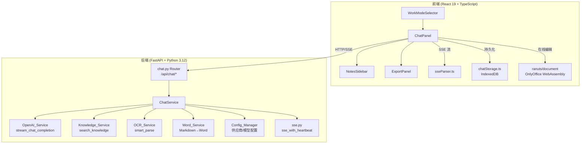
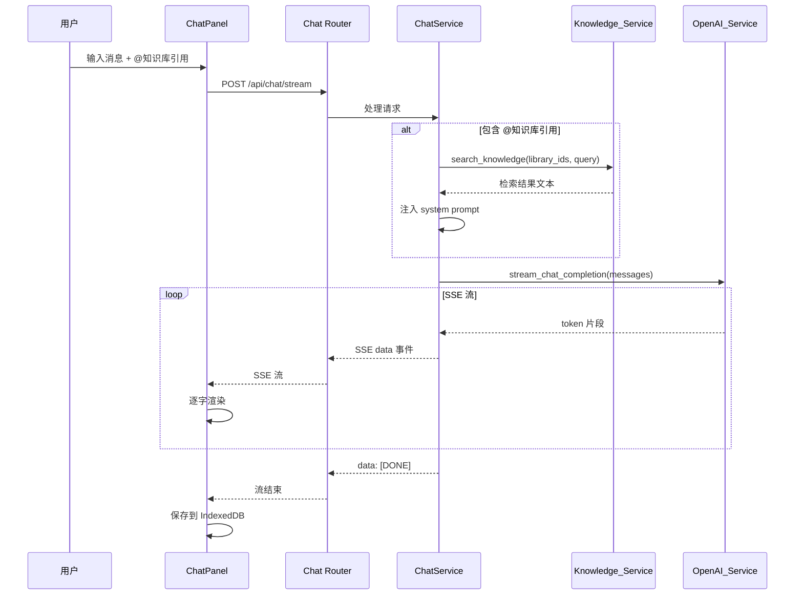

# 设计文档：首页聊天功能

## 概述

在致同 AI 审计助手首页（WorkModeSelector）增加一个 AI 聊天面板（ChatPanel），提供日常对话、知识库 RAG 检索、快捷指令联动四大工作模块、文档/截图上传、语音输入、笔记管理和对话导出等功能。

核心设计原则：
- 最大化复用已有基础设施（openai_service、knowledge_service、knowledge_retriever、ocr_service、word_service、sseParser、auditStorage 模式）
- 后端新增独立的 `chat.py` 路由 + `chat_service.py` 服务，不侵入现有模块
- 前端新增 `ChatPanel.tsx` 组件及子组件，以可折叠面板形式嵌入首页
- 遵循 GT Design System 设计规范

## 架构

### 系统架构图



### 数据流



## 组件与接口

### 前端组件树

```
WorkModeSelector (已有)
├── ChatPanel.tsx                 # 聊天面板主组件（可折叠）
│   ├── ChatWelcome.tsx           # 欢迎引导 + 模块快捷入口
│   ├── ChatMessageList.tsx       # 消息列表（用户/AI 消息渲染）
│   │   ├── UserMessage           # 用户消息气泡（右对齐）
│   │   └── AssistantMessage      # AI 消息气泡（左对齐，Markdown 渲染）
│   │       ├── 复制/导出Word/保存笔记 按钮
│   │       └── 模块推荐按钮（解析 [推荐模块:xxx]）
│   ├── ChatInput.tsx             # 输入区域
│   │   ├── @知识库候选列表（KnowledgePopup）
│   │   ├── /快捷指令候选列表（CommandPopup）
│   │   ├── 图片缩略图预览区
│   │   ├── 📎 上传按钮 + 🎤 语音按钮 + 发送/停止按钮
│   │   └── 知识库标签（Tag 样式，可移除）
│   ├── NotesSidebar.tsx          # 笔记侧边栏（可展开/收起）
│   │   ├── 按日期分组列表
│   │   ├── 笔记预览
│   │   └── 删除/移动/复制操作
│   └── ExportPanel.tsx           # 多选导出面板
│       ├── 消息多选 checkbox
│       ├── 导出预览编辑器（Markdown）
│       └── AI 润色按钮
```

### 后端模块

```
backend/app/
├── routers/
│   └── chat.py                   # 聊天路由 /api/chat/*
├── services/
│   └── chat_service.py           # 聊天服务（会话管理、RAG 注入、文档处理）
├── models/
│   └── chat_schemas.py           # 聊天相关 Pydantic 模型
```

### 后端 API 接口

#### 1. POST /api/chat/stream — 流式聊天

请求体：
```json
{
  "messages": [
    {"role": "user", "content": "帮我解释一下审计抽样方法"}
  ],
  "knowledge_library_ids": ["accounting_standards", "notes"],
  "document_context": "（可选）已上传文档的文本内容",
  "image_ocr_context": "（可选）已上传图片的 OCR 文本"
}
```

响应：SSE 流
```
data: 审计抽样方法
data: 是指...
data: [DONE]
data: {"meta": {"knowledge_refs": ["accounting_standards"], "suggest_save_note": true}}
```

SSE 协议约定：
- 普通 `data:` 行为 AI 生成的文本片段
- `data: [DONE]` 标记文本流结束
- `[DONE]` 之后紧跟一条 `data: {"meta": {...}}` 携带元数据：
  - `knowledge_refs`: 实际参与检索的知识库 ID 列表（前端渲染"已参考：@XX库"）
  - `suggest_save_note`: 布尔值，本地规则检测是否建议保存到笔记

#### 2. POST /api/chat/upload — 文档/图片上传

请求：`multipart/form-data`，字段 `file`（单文件，≤20MB）

响应：
```json
{
  "success": true,
  "filename": "审计底稿.pdf",
  "size": 1024000,
  "content": "提取的文本内容...",
  "ocr_method": "pytesseract"
}
```

#### 3. POST /api/chat/speech-to-text — 语音识别

请求：`multipart/form-data`，字段 `audio`（WebM/WAV，≤120秒）

响应：
```json
{
  "success": true,
  "text": "识别出的文本内容"
}
```

#### 4. POST /api/chat/export-word — 导出 Word

请求体：
```json
{
  "content": "Markdown 格式的导出内容",
  "filename": "聊天记录_20260406_143000"
}
```

响应：Word 文件流（application/octet-stream）

#### 5. POST /api/chat/notes — 保存笔记

请求体：
```json
{
  "title": "审计抽样方法说明",
  "content": "笔记 Markdown 内容...",
  "date": "2026-04-06"
}
```

响应：
```json
{
  "success": true,
  "doc_id": "uuid",
  "message": "已保存到笔记库"
}
```

#### 6. GET /api/chat/notes — 获取笔记列表（按日期分组）

响应：
```json
{
  "groups": [
    {
      "date": "2026-04-06",
      "notes": [
        {"id": "uuid", "title": "...", "created_at": "...", "size": 1024}
      ]
    }
  ],
  "total_count": 42,
  "total_size": 3145728
}
```

#### 7. DELETE /api/chat/notes/{doc_id} — 删除笔记

#### 8. POST /api/chat/notes/cleanup-suggest — AI 清理建议

请求体：
```json
{
  "threshold_count": 50,
  "threshold_size_mb": 5
}
```

响应：
```json
{
  "suggestions": [
    {
      "doc_id": "uuid",
      "title": "...",
      "created_at": "...",
      "reason": "内容与另一条笔记重复",
      "last_rag_reference": null
    }
  ]
}
```

#### 9. POST /api/chat/polish — AI 润色

请求体：
```json
{
  "content": "待润色的 Markdown 内容"
}
```

响应：SSE 流（润色后的内容）

#### 10. POST /api/knowledge/move — 文档移动

请求体：
```json
{
  "doc_ids": ["uuid1", "uuid2"],
  "source_library_id": "accounting_standards",
  "target_library_id": "notes",
  "target_date_folder": "2026-04-06"
}
```

#### 11. POST /api/knowledge/copy — 文档复制

请求体同上。

### 前端关键接口

```typescript
// chatStorage.ts — IndexedDB 持久化
interface ChatSession {
  id: string;
  messages: ChatMessage[];
  createdAt: string;
  updatedAt: string;
}

interface ChatMessage {
  id: string;
  role: 'user' | 'assistant' | 'system';
  content: string;
  timestamp: string;
  knowledgeRefs?: string[];        // 引用的知识库 ID
  attachments?: ChatAttachment[];  // 上传的文件/图片
  moduleRecommendation?: string;   // AI 推荐的模块 key
}

interface ChatAttachment {
  filename: string;
  size: number;
  type: 'document' | 'image';
  content?: string;                // 提取/OCR 的文本
  thumbnailUrl?: string;           // 图片缩略图 data URL
}

// 持久化 API
saveChatSession(session: ChatSession): Promise<void>;
loadChatSession(): Promise<ChatSession | null>;
archiveChatSession(session: ChatSession): Promise<void>;
// 归档存储：IndexedDB 中维护两个 object store
//   - 'chat_current': 当前活跃会话（只有一条）
//   - 'chat_archive': 归档会话列表（新建对话时当前会话移入此处）
// archiveChatSession 将 session 写入 chat_archive，清空 chat_current
```

```typescript
// SSE 中断处理（需求 1.4-1.5 停止按钮）
// ChatPanel 维护一个 AbortController 实例
// 发送请求时传入 signal: abortController.signal
// 点击停止按钮 → abortController.abort()
// fetch 抛出 AbortError → 保留已渲染的部分内容，恢复发送按钮
// 下次发送时创建新的 AbortController
```

```typescript
// ChatPanel props
interface ChatPanelProps {
  onSelectMode: (mode: 'review' | 'generate' | 'analysis' | 'report_review') => void;
  currentModel?: string;
}
```

### 自动滚动

ChatMessageList 使用 `useEffect` + `useRef` 实现自动滚动到底部：

```typescript
const messagesEndRef = useRef<HTMLDivElement>(null);
useEffect(() => {
  messagesEndRef.current?.scrollIntoView({ behavior: 'smooth' });
}, [messages]);
// 在消息列表末尾放置 <div ref={messagesEndRef} />
```

### 图片消息展示

用户发送的图片在对话区域中以缩略图形式展示（最大宽度 300px），点击可弹出全屏预览（使用模态框 + `object-fit: contain`）。AI 回复中标注"已识别图片内容"使用 `var(--gt-text-secondary)` 色的小标签。

### 多图上传

`/api/chat/upload` 端点支持单文件上传，前端多张图片时循环调用（最多 5 次），所有 OCR 结果合并为一个 `image_ocr_context` 字符串（用 `\n---\n` 分隔各图片内容），一起传入 `/api/chat/stream`。


## 数据模型

### 后端 Pydantic 模型（chat_schemas.py）

```python
from pydantic import BaseModel, Field
from typing import List, Optional
from datetime import datetime

class ChatMessage(BaseModel):
    """聊天消息"""
    role: str = Field(..., description="角色: user/assistant/system")
    content: str = Field(..., description="消息内容")

class ChatStreamRequest(BaseModel):
    """流式聊天请求"""
    messages: List[ChatMessage] = Field(..., description="对话历史")
    knowledge_library_ids: Optional[List[str]] = Field(None, description="要检索的知识库 ID 列表，非空时自动启用 RAG 检索")
    document_context: Optional[str] = Field(None, description="上传文档的文本内容")
    image_ocr_context: Optional[str] = Field(None, description="上传图片的 OCR 文本")

class ChatUploadResponse(BaseModel):
    """文档上传响应"""
    success: bool
    filename: str
    size: int
    content: str = ""
    ocr_method: str = ""
    error: Optional[str] = None

class SpeechToTextResponse(BaseModel):
    """语音识别响应"""
    success: bool
    text: str = ""
    error: Optional[str] = None

class ExportWordRequest(BaseModel):
    """Word 导出请求"""
    content: str = Field(..., description="Markdown 内容")
    filename: Optional[str] = Field(None, description="文件名（不含扩展名）")

class NoteCreateRequest(BaseModel):
    """笔记创建请求"""
    title: str = Field(..., description="笔记标题")
    content: str = Field(..., description="笔记内容 Markdown")
    date: Optional[str] = Field(None, description="日期 YYYY-MM-DD，默认今天")

class NoteItem(BaseModel):
    """笔记条目"""
    id: str
    title: str
    created_at: str
    size: int

class NoteGroup(BaseModel):
    """按日期分组的笔记"""
    date: str
    notes: List[NoteItem]

class NotesListResponse(BaseModel):
    """笔记列表响应"""
    groups: List[NoteGroup]
    total_count: int
    total_size: int

class CleanupSuggestion(BaseModel):
    """清理建议条目"""
    doc_id: str
    title: str
    created_at: str
    reason: str
    last_rag_reference: Optional[str] = None

class CleanupSuggestResponse(BaseModel):
    """清理建议响应"""
    suggestions: List[CleanupSuggestion]

class PolishRequest(BaseModel):
    """AI 润色请求"""
    content: str = Field(..., description="待润色的 Markdown 内容")

class KnowledgeMoveRequest(BaseModel):
    """知识库文档移动/复制请求"""
    doc_ids: List[str] = Field(..., description="文档 ID 列表")
    source_library_id: str = Field(..., description="源知识库 ID")
    target_library_id: str = Field(..., description="目标知识库 ID")
    target_date_folder: Optional[str] = Field(None, description="目标日期文件夹（仅笔记库）")
```

### 前端 TypeScript 类型（chat.ts）

```typescript
export interface ChatMessage {
  id: string;
  role: 'user' | 'assistant';
  content: string;
  timestamp: string;
  knowledgeRefs?: string[];
  attachments?: ChatAttachment[];
  moduleRecommendation?: string;
  savedToNotes?: boolean;
}

export interface ChatAttachment {
  filename: string;
  size: number;
  type: 'document' | 'image';
  content?: string;
  thumbnailUrl?: string;
}

export interface ChatSession {
  id: string;
  messages: ChatMessage[];
  createdAt: string;
  updatedAt: string;
}

export interface KnowledgeRef {
  libraryId: string;
  libraryName: string;
}

export interface QuickCommand {
  command: string;
  label: string;
  mode: 'review' | 'generate' | 'analysis' | 'report_review';
  icon: string;
}

export const QUICK_COMMANDS: QuickCommand[] = [
  { command: '/复核', label: '底稿复核', mode: 'review', icon: '📋' },
  { command: '/生成', label: '文档生成', mode: 'generate', icon: '📝' },
  { command: '/分析', label: '文档分析', mode: 'analysis', icon: '🔍' },
  { command: '/报告复核', label: '审计报告复核', mode: 'report_review', icon: '📊' },
];

export interface NoteItem {
  id: string;
  title: string;
  createdAt: string;
  size: number;
}

export interface NoteGroup {
  date: string;
  notes: NoteItem[];
}
```

### Knowledge_Service 扩展

在 `knowledge_service.py` 的 `LIBRARIES` 字典中新增 `notes` 分类：

```python
LIBRARIES = {
    # ... 现有 8 个分类 ...
    'notes': {
        'name': '笔记库',
        'desc': '聊天中保存的对话记录、文档摘要和用户笔记，可被 RAG 检索并联动其他工作模块'
    },
}
```

笔记库的特殊处理：
- 文件存储路径：`~/.gt_audit_helper/knowledge/notes/{YYYY-MM-DD}/`
- 保存笔记时自动创建当天日期子文件夹
- 索引文件 `index.json` 中每条记录增加 `date_folder` 字段
- 其他知识库分类无日期子文件夹结构，移动笔记到其他分类时平铺

Knowledge_Service 新增方法：

```python
def add_note(self, title: str, content: str, date: str = None) -> Dict:
    """保存笔记到日期子文件夹，date 默认今天"""

def get_notes_grouped(self) -> List[Dict]:
    """获取笔记列表，按日期分组返回"""

def move_documents(self, doc_ids: List[str], source_lib: str, target_lib: str, 
                   target_date_folder: str = None) -> Dict:
    """移动文档：从源库删除，添加到目标库
    - 目标为笔记库时放入 target_date_folder 子文件夹
    - 目标为非笔记库时平铺（忽略 target_date_folder）
    - 同名文档自动追加序号
    """

def copy_documents(self, doc_ids: List[str], source_lib: str, target_lib: str,
                   target_date_folder: str = None) -> Dict:
    """复制文档：保留源库，在目标库创建副本，规则同 move_documents"""
```

### ChatService 核心逻辑

```python
class ChatService:
    """聊天服务 — 会话管理、RAG 注入、文档处理"""

    # 模块功能描述（注入 system prompt，使 LLM 了解可用工具）
    MODULE_DESCRIPTIONS = """
    你是致同AI审计助手。用户可以使用以下专业工作模块：
    - 底稿复核（/复核）：上传审计底稿，多维度智能复核
    - 文档生成（/生成）：基于模板与知识库生成审计文档
    - 文档分析（/分析）：上传文档进行总结分析和汇总
    - 审计报告复核（/报告复核）：校验金额勾稽、正文规范性
    
    当用户的问题更适合使用某个模块时，在回答末尾添加 [推荐模块:review/generate/analysis/report_review]。
    """

    # 笔记保存建议 — 本地规则关键词（不调 LLM，优先用规则检测）
    NOTE_SUGGEST_KEYWORDS = [
        r'第\d+[条号]',           # 法规条文引用
        r'准则第?\d+号',          # 会计/审计准则引用
        r'[\d,]+\.?\d*\s*[万亿元]', # 金额数值
        r'\|.*\|.*\|',           # 表格数据
        r'```',                   # 代码块
        r'结论[：:]',             # 审计结论
        r'建议[：:]',             # 审计建议
    ]

    def should_suggest_save_note(self, reply_content: str) -> bool:
        """本地规则检测是否建议保存到笔记（不调 LLM）"""
        import re
        return any(re.search(kw, reply_content) for kw in self.NOTE_SUGGEST_KEYWORDS)

    async def build_messages(
        self,
        messages: List[dict],
        knowledge_library_ids: Optional[List[str]],
        document_context: Optional[str],
        image_ocr_context: Optional[str],
    ) -> List[dict]:
        """构建发送给 LLM 的完整 messages 列表"""
        system_parts = [self.MODULE_DESCRIPTIONS]

        # 知识库 RAG 注入（有 knowledge_library_ids 就检索，没有就跳过）
        if knowledge_library_ids:
            user_query = messages[-1]["content"] if messages else ""
            kb_content = knowledge_service.search_knowledge(
                knowledge_library_ids, user_query
            )
            if kb_content:
                system_parts.append(f"以下是从知识库检索到的参考资料：\n{kb_content}")

        # 文档上下文注入
        if document_context:
            system_parts.append(f"用户上传了文档，内容如下：\n{document_context}")

        # 图片 OCR 上下文注入
        if image_ocr_context:
            system_parts.append(f"用户上传了图片，OCR 识别内容：\n{image_ocr_context}")

        system_message = {"role": "system", "content": "\n\n".join(system_parts)}

        # token 截断：保持在模型上下文窗口内
        full_messages = [system_message] + messages
        return self._truncate_messages(full_messages)

    def _truncate_messages(self, messages: List[dict]) -> List[dict]:
        """截断较早的消息以适应上下文窗口
        
        策略：
        1. 从 config_manager 获取当前模型的上下文窗口大小
        2. 预留 30% 给输出（与 knowledge_retriever 一致）
        3. system 消息始终保留
        4. 从最早的 user/assistant 消息开始删除，直到总 token 数在预算内
        5. 至少保留最近 2 轮对话（4 条消息）
        """
        from ..services.openai_service import estimate_token_count, _get_context_limit
        from ..utils.config_manager import ConfigManager
        
        model_name = ConfigManager().get_active_model() or "default"
        context_limit = _get_context_limit(model_name)
        max_input_tokens = int(context_limit * 0.7)  # 70% 给输入
        
        # system 消息始终保留
        system_msg = messages[0] if messages and messages[0]["role"] == "system" else None
        history = messages[1:] if system_msg else messages
        
        # 从前往后删除，直到总 token 在预算内
        total = estimate_token_count(system_msg["content"]) if system_msg else 0
        keep_from = 0
        for i, msg in enumerate(history):
            total += estimate_token_count(msg["content"])
        
        while total > max_input_tokens and keep_from < len(history) - 4:
            total -= estimate_token_count(history[keep_from]["content"])
            keep_from += 1
        
        result = ([system_msg] if system_msg else []) + history[keep_from:]
        return result
```

### 前端输入解析逻辑

ChatInput 组件需要处理三种特殊输入触发：

```typescript
// ChatInput.tsx 核心解析逻辑

// 1. @ 触发知识库候选
// 监听 onChange，检测光标前最近的 @ 字符
// 提取 @ 后的文字作为过滤关键词
// 弹出 KnowledgePopup，模糊匹配知识库名称
// 选中后替换 @xxx 为不可编辑的 Tag 组件，记录 libraryId

// 2. / 触发快捷指令
// 仅在输入框为空或光标在行首时触发
// 弹出 CommandPopup，匹配 QUICK_COMMANDS
// 选中后调用 onSelectMode(command.mode)，不发送消息

// 3. Ctrl+V 粘贴图片
// 监听 onPaste 事件，检查 clipboardData.items
// 如果包含 image/* 类型，提取 Blob 生成缩略图预览
// 存入 pendingImages 状态，发送时一起上传
```

### 语音录音前端实现

```typescript
// 使用 MediaRecorder API
// 1. 点击 🎤 → navigator.mediaDevices.getUserMedia({ audio: true })
// 2. 创建 MediaRecorder(stream, { mimeType: 'audio/webm' })
// 3. recorder.ondataavailable → 收集 Blob chunks
// 4. 再次点击 🎤 → recorder.stop()
// 5. 合并 chunks 为 Blob，POST /api/chat/speech-to-text
// 6. 120 秒超时自动 stop
// 7. 不支持 MediaRecorder 时隐藏按钮（检测 window.MediaRecorder）
```

### Whisper 语音识别后端实现

```python
# chat_service.py 中的语音识别方法
async def speech_to_text(self, audio_file: UploadFile) -> str:
    """调用 OpenAI 兼容的 Whisper API 进行语音识别
    
    - 复用 config_manager 中配置的 API base_url 和 api_key
    - 端点：POST {base_url}/audio/transcriptions
    - 模型：whisper-1（或供应商兼容的 STT 模型）
    - 支持 webm/wav/mp3 格式
    - 如果当前供应商不支持 Whisper，回退到本地方案或返回错误提示
    """
```

### Markdown 渲染方案

AI 回复的 Markdown 渲染使用 `react-markdown` + `remark-gfm`（支持表格、删除线）+ `rehype-highlight`（代码高亮）：

```typescript
// AssistantMessage 中的渲染
import ReactMarkdown from 'react-markdown';
import remarkGfm from 'remark-gfm';
import rehypeHighlight from 'rehype-highlight';

<ReactMarkdown remarkPlugins={[remarkGfm]} rehypePlugins={[rehypeHighlight]}>
  {message.content}
</ReactMarkdown>
```

注意：需要在 `frontend/package.json` 中新增依赖：`react-markdown`、`remark-gfm`、`rehype-highlight`。

### 富文本复制方案

复制按钮需要将 Markdown 转为 HTML 写入剪贴板，确保粘贴到 Word 时格式不乱：

```typescript
// 复制富文本到剪贴板
async function copyRichText(markdown: string): Promise<boolean> {
  try {
    // 1. 将 Markdown 转为 HTML（复用 react-markdown 的渲染管线）
    //    使用 unified + remark-parse + remark-gfm + remark-rehype + rehype-stringify
    const html = markdownToHtml(markdown);
    
    // 2. 同时写入 text/html 和 text/plain 两种格式
    //    text/html → 粘贴到 Word/富文本编辑器时保留格式
    //    text/plain → 粘贴到纯文本编辑器时使用 Markdown 原文
    await navigator.clipboard.write([
      new ClipboardItem({
        'text/html': new Blob([html], { type: 'text/html' }),
        'text/plain': new Blob([markdown], { type: 'text/plain' }),
      })
    ]);
    return true;
  } catch {
    // 回退：复制纯文本
    await navigator.clipboard.writeText(markdown);
    return true;
  }
}
```

注意：需要额外安装 `unified`、`remark-parse`、`remark-rehype`、`rehype-stringify` 用于服务端/工具函数中的 Markdown→HTML 转换（`react-markdown` 只在 JSX 渲染中使用，不能直接输出 HTML 字符串）。

### 模型名称显示

ChatPanel 顶部栏显示当前模型名称，通过调用 `/api/config/active` 获取当前激活的供应商和模型名，格式如"DeepSeek-V3.2"。模型切换后下次打开聊天面板时自动刷新。

### main.py 路由注册

```python
# main.py 中新增
from .routers import chat
app.include_router(chat.router)
```

路由注册位置：在现有 `report_review.router` 之后、健康检查端点之前。

### ExportPanel 多选状态管理

```typescript
// ChatPanel 中维护导出相关状态
const [exportMode, setExportMode] = useState(false);        // 是否处于多选模式
const [selectedMsgIds, setSelectedMsgIds] = useState<Set<string>>(new Set());
const [exportContent, setExportContent] = useState('');      // 合并后的 Markdown
const [showExportEditor, setShowExportEditor] = useState(false); // 编辑面板可见

// 进入多选模式：setExportMode(true)，每条消息前显示 checkbox
// 全选：selectedMsgIds = new Set(messages.map(m => m.id))
// 仅选 AI：selectedMsgIds = new Set(messages.filter(m => m.role === 'assistant').map(m => m.id))
// 确认导出：合并选中消息为 Markdown → setExportContent → setShowExportEditor(true)
// 取消：setExportMode(false)，清空 selectedMsgIds
```

### ranuts/document 在线编辑器集成

基于 [ranuts/document](https://github.com/ranuts/document) 纯前端 OnlyOffice 编辑器，在聊天导出流程中提供"在线编辑"选项。

```
依赖：@ranui/preview（npm 包，纯前端 WebAssembly，无需后端服务）

集成方式：
1. 后端 /api/chat/export-word 生成 Word 文件，返回 Blob
2. 前端将 Blob 转为 URL（URL.createObjectURL）
3. 在模态框中加载 ranuts/document 编辑器，传入文件 URL
4. 用户编辑完成后，从编辑器获取修改后的文件 Blob
5. 提供"下载"按钮触发浏览器下载

组件：DocumentEditorModal.tsx
- props: fileBlob (Blob), filename (string), onClose (callback)
- 全屏模态框，顶部工具栏含"下载"和"关闭"按钮
- 内部嵌入 ranuts/document 编辑器实例
```

注意：此次仅在聊天导出中集成，后续四大工作模块的在线编辑作为独立 spec 处理。

### GT Design System 样式规范

聊天面板所有 UI 元素遵循致同 GT 设计系统（`gt-design-tokens.css`）：

```
颜色：
- 主色：var(--gt-primary) #4b2d77（聊天面板标题栏、发送按钮、@标签背景）
- 亮紫：var(--gt-primary-light) #A06DFF（hover 状态、选中高亮）
- 深紫：var(--gt-primary-dark) #2B1D4D（面板折叠按钮背景）
- 用户消息气泡：#f3f0f8（浅紫灰，右对齐）
- AI 消息气泡：#ffffff（白色，左对齐，1px #e8e8e8 边框）
- 错误提示：var(--gt-danger) #FF5149
- 成功提示：var(--gt-success) #0094B3

圆角：
- 聊天面板：var(--gt-radius-lg) 12px
- 消息气泡：var(--gt-radius-md) 8px
- 输入框：var(--gt-radius-md) 8px
- 按钮：var(--gt-radius-sm) 4px
- @知识库标签：var(--gt-radius-sm) 4px

间距：
- 面板内边距：var(--gt-space-4) 16px
- 消息间距：var(--gt-space-3) 12px
- 输入框内边距：var(--gt-space-2) 8px

字体：
- 消息正文：var(--gt-font-sm) 14px
- 面板标题：var(--gt-font-base) 16px，font-weight: 600
- 时间戳/元信息：var(--gt-font-xs) 12px，color: var(--gt-text-secondary)
- 代码块：monospace，背景 #f5f5f5

操作按钮（复制/导出/保存笔记）：
- 默认隐藏，hover 消息气泡时显示
- 图标大小 16px，颜色 var(--gt-text-secondary)
- hover 变为 var(--gt-primary)

欢迎卡片：
- 复用 WorkModeSelector 的模块卡片样式（2px border、hover 变紫色边框+阴影）
- 网格布局 2x2

笔记侧边栏：
- 宽度 280px，右侧滑出
- 日期分组标题：font-weight: 600，color: var(--gt-primary)
- 笔记条目：hover 背景 #f9f7fc

录音状态：
- 🎤 按钮录音中：红色脉冲动画（@keyframes pulse，border-color: #FF5149）
- 计时器：var(--gt-font-xs)，color: #FF5149
```

